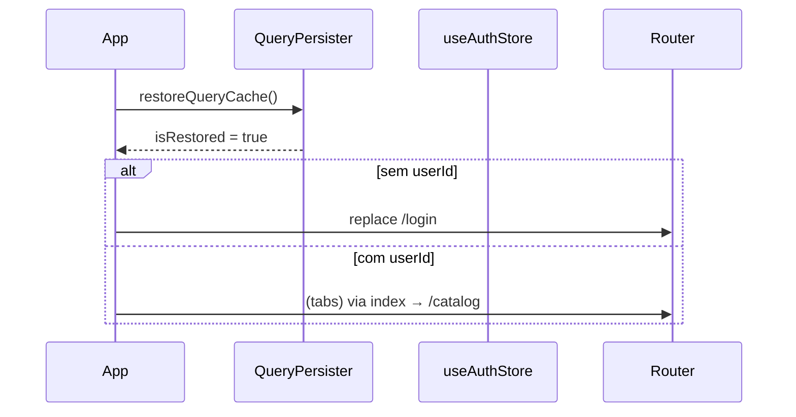
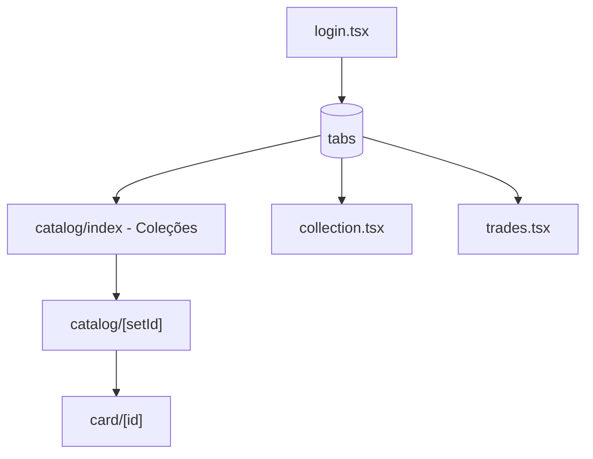

# AGENTS.md — Contexto para agentes de IA

Leia este arquivo **antes** de implementar mudanças.

| Documento | Público |
|-----------|---------|
| [README.md](./README.md) | Humanos (setup, visão do produto) |
| [.agent.md](./.agent.md) | Boot Expo / emulador Android apenas |
| **AGENTS.md** (este) | Arquitetura, convenções, armadilhas |

**Repositório:** `https://github.com/thiagonunes11/pokemon-trade-center.git`

---

## 1. Visão geral

| Campo | Valor |
|-------|--------|
| **Nome** | Pokemon Trade Center |
| **Tipo** | App mobile MVP (Expo / React Native) |
| **Domínio** | Pokémon TCG — catálogo, coleção pessoal, trocas (futuro) |
| **UI** | Português (Brasil); evitar jargão técnico na interface |
| **Dados remotos** | [TCGdex](https://tcgdex.dev/) locale `pt` |
| **Conta** | Local por dispositivo (sem servidor) |

**Fora de escopo:** backend, OAuth, sync na nuvem, chat, pagamentos, scanner.

---

## 2. Stack e versões

| Camada | Pacote / nota |
|--------|----------------|
| Expo ~56, RN 0.85, React 19 | `package.json` |
| Expo Router | Rotas em `src/app/` (não `/app` na raiz) |
| Tamagui | `tamagui.config.ts` na raiz; temas `dark_phantom` / `light_phantom` |
| `@tcgdex/sdk` | `new TCGdex("pt")` em `src/lib/tcgdex.ts` |
| TanStack Query v5 | Cache persistido via `queryPersister.ts` |
| Zustand v5 + persist | Auth + coleção em `safeStorage` |
| `expo-image` | Thumbnails e arte das cartas |
| Path alias | `@/*` → `src/*` (`tsconfig.json`) |

---

## 3. Estrutura de diretórios

```
src/app/
  index.tsx                 → Redirect href="/catalog"
  login.tsx                 → Conta local (nome → UUID)
  _layout.tsx               → ThemeProvider, Query, splash cache, auth guard
  (tabs)/
    _layout.tsx             → 3 abas: Catálogo, Coleção, Trocas
    catalog/
      _layout.tsx           → Stack interno (voltar Coleções ↔ grid)
      index.tsx             → Picker de expansões + ThemeToggle
      [setId].tsx           → Grid + CatalogHeaderTitle (000/188)
    collection.tsx          → Lista da coleção (all / por set / recentes)
    trades.tsx              → Placeholder
  card/[id].tsx             → Detalhe + toggle coleção

src/features/
  cards/                    → CardGrid, CardItem, useSetCards, useCard
  sets/                     → CollectionPickerCard, useCollections

src/hooks/
  useOwnedSetCount.ts         → useOwnedSetCount, useOwnedCountsBySet

src/lib/
  tcgdex.ts, collections.ts, formatCollectionProgress.ts
  queryClient.ts, queryPersister.ts, safeStorage.ts, storagePolyfill.ts

src/store/
  useAuthStore.ts           → ptc-auth-storage
  useCollectionStore.ts     → pokemon-collection-storage (ownerId)

src/theme/
  ThemeContext.tsx, colors.ts, useAppTheme, useStyles

src/components/
  ThemeToggle.tsx           → Usado no header de catalog/index (Coleções)
```

---

## 4. Ciclo de vida ao abrir o app



1. `storagePolyfill` importado cedo (`_layout.tsx`, `tcgdex.ts`).
2. `restoreQueryCache` → overlay **"Carregando dados locais..."** até `isRestored`.
3. `useEffect`: se `isRestored && !userId` → `router.replace('/login')`.
4. Login: `login(name)` → `router.replace('/')` → `index` redireciona para `/catalog`.

**Ordem obrigatória em `_layout.tsx`:** declarar `useState(isRestored)` **antes** de qualquer `useEffect` que leia `isRestored`.

`login.tsx` não aparece em `<Stack.Screen>` explícito — o Expo Router descobre pelo filesystem (`src/app/login.tsx` → `/login`).

---

## 5. Navegação



| Rota | Tela |
|------|------|
| `/login` | Criar conta local |
| `/catalog` | Lista de expansões (tab Catálogo, header oculto na tab) |
| `/catalog/[setId]` | Grid do set |
| `/card/[id]` | Detalhe (Stack root, header opaco) |
| `/(tabs)/collection` | Minha coleção |

**Stack em `catalog/_layout.tsx`** é obrigatório: sem ele não há botão voltar entre Coleções e o grid. `headerBackTitle: "Coleções"` no Android/iOS.

**Header do grid:** componente local `CatalogHeaderTitle` em `[setId].tsx` — título + badge `formatCollectionProgress` via `useLayoutEffect`.

---

## 6. Autenticação e coleção

### Auth (`useAuthStore`)

| Campo / método | Comportamento |
|----------------|---------------|
| `login(username)` | Gera `userId` (UUID v4), persiste em `ptc-auth-storage` |
| `logout()` | Limpa `userId` e `username` — **sem UI** hoje |
| Guard | `_layout.tsx` após restore do cache |

### Coleção (`useCollectionStore`)

```ts
interface CollectionCard {
  id: string;           // ex: "me02-15"
  name: string;
  imageUrl: string | null;
  setId: string;
  ownerId?: string | null;
  addedAt: Date;
}
```

| Método | Regra |
|--------|--------|
| `addCard` | Grava `ownerId` = `useAuthStore.getState().userId` |
| `hasCard` / `removeCard` / `getSetCardCount` | Filtram por `ownerId` atual |

**Em componentes React:** preferir `useOwnedSetCount` / `useOwnedCountsBySet` para exibir progresso — eles leem `cards` + `userId` com `useMemo`.

**Evitar** no JSX: `useCollectionStore((s) => s.getSetCardCount)` — quebrou com hot reload (`Property 'getSetCardCount' doesn't exist`).

### Formato do progresso

`formatCollectionProgress(owned, total)` → `"005/188 cartas"` (padding mínimo 3 dígitos no owned, largura segue `total`).

Usado em: `CollectionPickerCard`, header do catálogo (`[setId].tsx`).

### Aba Coleção (`collection.tsx`)

- Filtra `cards` onde `ownerId === authUserId` no componente.
- Modos: `all` | `bySet` | `recent` (ordenado por `addedAt`).
- Navega para `/card/[id]` ao tocar na carta.
- **Não** tem `ThemeToggle` — toggle de tema só em **Coleções** (`catalog/index`).

---

## 7. Cache React Query

| Chave | Onde | staleTime |
|-------|------|-----------|
| `["set", setId]` | `useCollections`, `useSet` | 30 min (picker) / default 7d (`queryClient`) |
| `["set-cards", setId]` | `useSetCards` | default 7d |
| `["card", cardId]` | `useCard` | default 7d |

- Persistência: `REACT_QUERY_PERSISTENT_CACHE` em AsyncStorage, debounce 1,5s.
- Só queries com `status === 'success'` são desidratadas.
- `refetchOnWindowFocus: false` (mobile).

---

## 8. Expansões (série Megaevolução)

Fonte de verdade: `SUPPORTED_SETS` em `tcgdex.ts` + `COLLECTIONS` em `collections.ts`.

| ID | Nome | UI |
|----|------|-----|
| `me01` | Megaevolução | Aberto |
| `me02` | Fogo Fantasmagórico | Aberto |
| `me02.5` | Heróis Excelsos | Aberto |
| `me03` | Equilíbrio Perfeito | Aberto |
| `me04` | Caos Ascendente | Bloqueado se API retorna 0 cartas |

Disponibilidade: `getCollectionAvailability(cardCount, isLoading)` → `loading` | `available` | `unavailable`.  
`me04` usa `unavailableMessage: "Catálogo em breve"`.

**Checklist — nova expansão**

1. Confirmar no TCGdex: `tcgdex.set.get('meXX')` com `cards.length > 0`.
2. Adicionar constante em `SUPPORTED_SETS` (`tcgdex.ts`).
3. Entrada em `COLLECTIONS` com `logoUrl` (`https://assets.tcgdex.net/pt/me/meXX/logo.webp`).
4. `useCollections` e picker passam a incluir automaticamente (mapeia `COLLECTIONS`).
5. Se API ainda vazia: opcional `unavailableMessage` — card desabilitado no picker.

**IDs de carta:** formato `me02-15` (set + localId). Detalhe usa `tcgdex.card.get(cardId)`.

Sets futuros mencionados no roadmap: `mep` (promos), `mee` — ainda não configurados.

---

## 9. Tema claro/escuro

- `ThemeProvider` envolve o app em `_layout.tsx`.
- Preferência: `pokemon-theme-preference` em `safeStorage`.
- Sem preferência salva: segue `useColorScheme()` do sistema.
- Telas: `const { colors } = useAppTheme()` + `const styles = useStyles(stylesFactory)` onde `stylesFactory` recebe `colors`.
- **Não** importar `colors` estático em telas novas.
- Tamagui: `theme={theme === "dark" ? "dark_phantom" : "light_phantom"}`.

---

## 10. Implementado vs. pendente

### Pronto

- [x] Login local + guard de rota
- [x] Picker de 5 expansões (me04 condicional à API)
- [x] Catálogo por set, pull-to-refresh, detalhe da carta
- [x] Add/remove na coleção (persistido)
- [x] Progresso `000/188 cartas` no picker e no header do grid
- [x] Aba Coleção com modos Todas / Por coleção / Recentes
- [x] Persistência Zustand + cache React Query
- [x] Tema claro/escuro (toggle em Coleções)

### Pendente

- [ ] Trocas (`trades.tsx`)
- [ ] UI de logout / troca de usuário local
- [ ] Auth real / sync nuvem
- [ ] Sets `mep`, `mee`
- [ ] Busca e filtros no grid
- [ ] Testes automatizados

---

## 11. Armadilhas conhecidas

| Problema | Causa / solução |
|----------|------------------|
| Sem botão voltar no catálogo | Manter `src/app/(tabs)/catalog/_layout.tsx` como Stack |
| `getSetCardCount doesn't exist` | Usar hooks `useOwnedSetCount`; `npx expo start --clear` |
| `isRestored` usado antes do state | `useState` antes do `useEffect` que depende dele |
| Contador errado com vários usuários locais | Hooks/contagens devem comparar `ownerId === userId` |
| Detalhe mostra carta “na coleção” errado | Em `card/[id].tsx`, `isInCollection` usa `cards.some` **sem** `ownerId` — preferir `hasCard(id)` da store |
| `@react-navigation/elements` | Não está no projeto — header custom via `useLayoutEffect` |
| Imagem coberta no detalhe | Header opaco; título no header nativo |
| me04 desabilitado | Normal até TCGdex publicar cartas |
| Grep com path `D:\...` no Windows | Usar path relativo ou Shell |
| Router durante render | Redirect de auth só em `useEffect`, não no corpo do componente |

---

## 12. Diretrizes para agentes

1. **Escopo mínimo** — não refatorar fora do pedido.
2. **Convenções** — `useAppTheme` + `useStyles`; textos em PT-BR.
3. **Rotas** — apenas em `src/app/`.
4. **Commits** — só se o usuário pedir explicitamente.
5. **Docs** — atualizar README + AGENTS.md se mudar fluxo, auth, sets ou persistência.
6. **Sets** — validar TCGdex antes de habilitar no picker.
7. **Multi-usuário local** — qualquer leitura de coleção deve respeitar `ownerId`.

---

## 13. Mapa rápido: arquivo → tarefa

| Tarefa | Arquivos principais |
|--------|---------------------|
| Nova expansão | `tcgdex.ts`, `collections.ts` |
| Login / guard | `useAuthStore.ts`, `login.tsx`, `_layout.tsx` |
| Progresso owned/total | `useOwnedSetCount.ts`, `formatCollectionProgress.ts`, `CollectionPickerCard.tsx` |
| Picker / disponibilidade | `catalog/index.tsx`, `useCollections.ts` |
| Grid do set | `catalog/[setId].tsx`, `CardGrid.tsx`, `useSetCards` |
| Detalhe + coleção | `card/[id].tsx`, `useCollectionStore.ts` |
| Lista “Minha Coleção” | `collection.tsx` |
| Tema | `ThemeContext.tsx`, `colors.ts`, `ThemeToggle.tsx` |
| Cache API | `queryPersister.ts`, `queryClient.ts` |
| Boot Expo | [.agent.md](./.agent.md) |

---

## 14. Comandos úteis

```bash
npm install
npx expo start --android
npx expo start --clear    # após erros de bundle / hot reload
npm run lint
```

---

*Última revisão: login local, persistência auth/coleção/query, tema claro/escuro, me01–me04, contador owned/total, aba Coleção com filtros, Stack do catálogo.*
