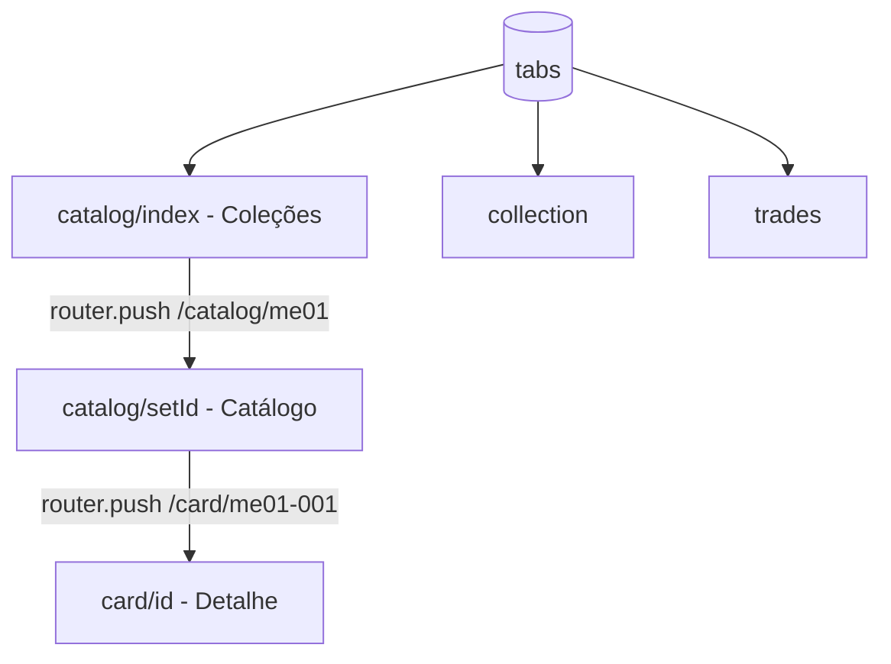

# AGENTS.md — Contexto para agentes de IA

Leia este arquivo **antes** de implementar mudanças neste repositório. Ele descreve o propósito do projeto, arquitetura, convenções e armadilhas conhecidas.

Documentação para humanos: [README.md](./README.md)  
Troubleshooting só de boot Expo: [.agent.md](./.agent.md)

---

## 1. Visão geral

| Campo                | Valor                                                              |
| -------------------- | ------------------------------------------------------------------ |
| **Nome**             | Pokemon Trade Center                                               |
| **Tipo**             | App mobile MVP (Expo / React Native)                               |
| **Domínio**          | Pokémon TCG — catálogo de cartas, coleção pessoal, trocas (futuro) |
| **Idioma da UI**     | Português (Brasil)                                                 |
| **Idioma dos dados** | Português via TCGdex (`pt`)                                        |
| **Estágio**          | Trabalho em andamento; várias telas são placeholder                |
| **Repositório**      | `https://github.com/thiagonunes11/pokemon-trade-center.git`        |

### Objetivo do produto

Permitir que o usuário:

1. Escolha uma **expansão** (set) da série Megaevolução
2. Navegue o **catálogo** de cartas com imagens e metadados da API
3. Veja **detalhe** da carta e **adicione/remova** da coleção local
4. (Futuro) Gerencie coleção completa e **trocas** com outros jogadores

Não é escopo atual: backend próprio, autenticação remota/OAuth, chat, pagamentos, scanner de cartas. **Conta local** (nome + UUID) já existe via `useAuthStore`.

---

## 2. Stack técnica

| Camada        | Tecnologia                | Versão relevante                                                           |
| ------------- | ------------------------- | -------------------------------------------------------------------------- |
| Runtime       | Expo SDK                  | ~56                                                                        |
| Framework UI  | React Native              | 0.85                                                                       |
| UI library    | React                     | 19                                                                         |
| Rotas         | Expo Router (file-based)  | ~56                                                                        |
| Estilo / tema | Tamagui + `src/theme`     | Temas `dark_phantom` e `light_phantom` reativos                            |
| API cartas    | `@tcgdex/sdk`             | TCGdex REST, locale `pt`                                                   |
| Cache remoto  | TanStack React Query      | query keys por set/card + Persistência (safeStorage + getCircularReplacer) |
| Estado local  | Zustand                   | Coleção persistida (safeStorage + AsyncStorage)                            |
| Imagens       | `expo-image`              | URLs `{base}/high.png` ou `.webp`                                          |
| Animações     | `react-native-reanimated` | telas de detalhe / grid                                                    |
| TypeScript    | strict                    | paths `@/*` → `./src/*`                                                    |
| Nativo        | pasta `android/`          | development build (`expo run:android`)                                     |

**Experiments ativos** (`app.json`): `typedRoutes`, `reactCompiler`.

---

## 3. Estrutura de diretórios (crítico)

```
src/app/                    ← Rotas Expo Router (NÃO usar /app na raiz)
  _layout.tsx               ← Root: QueryClient, Tamagui, auth guard, splash cache
  login.tsx                 ← Conta local (nome → UUID)
  (tabs)/
    _layout.tsx             ← Tab bar: Catálogo, Coleção, Trocas
    catalog/
      _layout.tsx           ← Stack interno (necessário para botão voltar)
      index.tsx             ← Lista de expansões (picker) + ThemeToggle
      [setId].tsx           ← Grid de cartas do set
    collection.tsx          ← Minha coleção: grid 4 colunas, Todas / Por coleção
    trades.tsx              ← Placeholder: texto estático
  card/[id].tsx             ← Detalhe da carta (Stack global, header nativo)
  index.tsx                 ← Redireciona `/` para `/catalog`

src/features/
  cards/                    ← CardGrid, CardItem (prop `compact`), useSetCards, useCard
  sets/                     ← CollectionPickerCard, useCollections

src/hooks/
  useOwnedSetCount.ts       ← useOwnedSetCount, useOwnedCountsBySet (progresso local)

src/lib/
  tcgdex.ts                 ← Cliente SDK + SUPPORTED_SETS
  collections.ts            ← COLLECTIONS[], disponibilidade, helpers
  formatCollectionProgress.ts  ← "005/188 cartas"
  queryClient.ts
  queryPersister.ts         ← Cache offline-first do React Query (debounced)
  safeStorage.ts            ← Invólucro resiliente com fallback (Web/Expo Go)
  storagePolyfill.ts        ← Importar antes do SDK (side effect)

src/components/             ← Componentes globais e reutilizáveis
  ThemeToggle.tsx           ← Botão animado de alternância de tema no header

src/store/
  useAuthStore.ts           ← userId, login/logout (ptc-auth-storage)
  useCollectionStore.ts     ← cards[] com ownerId (getSetCardCount só na store)

src/theme/                  ← colors, typography, ThemeContext (ThemeProvider, useAppTheme, useStyles)
tamagui.config.ts           ← temas Tamagui (dark_phantom e light_phantom) na raiz do projeto
```

**Regra:** telas e rotas vivem em `src/app/`. O Expo detecta `src/app` como router root automaticamente.

---

## 4. Navegação e fluxos



| Rota                      | Arquivo               | Header                                                 |
| ------------------------- | --------------------- | ------------------------------------------------------ |
| `/(tabs)/catalog`         | `catalog/index.tsx`   | Stack: "Coleções"; cada card mostra `000/188 cartas`   |
| `/(tabs)/catalog/[setId]` | `catalog/[setId].tsx` | Stack: título + badge `000/188` (`CatalogHeaderTitle`) |
| `/(tabs)/collection`      | `collection.tsx`      | Tab: grid 4 colunas; filtros Todas / Por coleção       |
| `/card/[id]`              | `card/[id].tsx`       | Stack global, opaco, botão voltar                      |
| `/login`                  | `login.tsx`           | Conta local; guard em `_layout.tsx`                    |

**Importante:** o fluxo Catálogo usa **Stack dentro da tab** (`catalog/_layout.tsx`). Tabs sozinhas **não** exibem botão voltar entre `index` e `[setId]`.

Navegação típica:

```ts
router.push({ pathname: "/catalog/[setId]", params: { setId } });
router.push({ pathname: "/card/[id]", params: { id: cardId } });
```

---

## 5. Dados — TCGdex API

### Cliente

```ts
// src/lib/tcgdex.ts
const tcgdex = new TCGdex("pt");
```

Sempre importar `@/lib/storagePolyfill` antes do SDK (já feito em `_layout.tsx` e `tcgdex.ts`).

### Expansões configuradas no app

Definidas em `SUPPORTED_SETS` + `COLLECTIONS` (`src/lib/collections.ts`):

| Constante             | ID API   | Nome exibido        | Catálogo no app           |
| --------------------- | -------- | ------------------- | ------------------------- |
| `MEGAEVOLUCAO`        | `me01`   | Megaevolução        | Sim                       |
| `FOGO_FANTASMAGORICO` | `me02`   | Fogo Fantasmagórico | Sim                       |
| `HEROIS_EXCELSOS`     | `me02.5` | Heróis Excelsos     | Sim                       |
| `EQUILIBRIO_PERFEITO` | `me03`   | Equilíbrio Perfeito | Sim                       |
| `CAOS_ASCENDENTE`     | `me04`   | Caos Ascendente     | **Não** (0 cartas na API) |

### Disponibilidade de coleção

Lógica em `getCollectionAvailability()`:

- `loading` → query em andamento
- `available` → `set.cards.length > 0`
- `unavailable` → sem cartas na resposta (ex.: `me04` hoje)

UI: card desabilitado, `unavailableMessage` (ex.: "Catálogo em breve" para Caos Ascendente). **Não** depender de flag manual — habilita automaticamente quando a API passar a retornar cartas.

### Contador de progresso (`owned/total`)

Função: `formatCollectionProgress(owned, total)` em `src/lib/formatCollectionProgress.ts` → string `"005/188 cartas"` (padding mínimo 3 dígitos no owned).

| Onde                  | Como obter owned               | Como obter total                                 |
| --------------------- | ------------------------------ | ------------------------------------------------ |
| `catalog/index.tsx`   | `useOwnedCountsBySet()`        | `set.cardCount.total` ou `cards.length` da query |
| `catalog/[setId].tsx` | `useOwnedSetCount(validSetId)` | `setData.cardCount.total` ou `cards.length`      |

**Não** usar `useCollectionStore((s) => s.getSetCardCount)` em componentes — o selector de função não re-renderiza bem e já causou `Property 'getSetCardCount' doesn't exist` com hot reload. Preferir sempre os hooks em `src/hooks/useOwnedSetCount.ts`.

### URLs de imagem

- Logo do set: `https://assets.tcgdex.net/pt/me/{id}/logo.webp`
- Carta alta resolução: `${card.image}/high.png` (detalhe) ou `/high.webp` (coleção)
- IDs de carta: `{setId}-{localId}` (ex. `me02.5-042` — setId pode conter ponto)

### Ícones de tipo/energia (locais)

A API devolve **nomes** (`Fogo`, `Incolor`, etc.), não URLs de ícones pequenos. O app usa PNGs em `assets/images/energy/`:

| Arquivo | Tipos TCGdex (pt) |
|---------|-------------------|
| `fire.png` | Fogo |
| `water.png` | Água |
| `grass.png` | Planta |
| `electric.png` | Elétrico |
| `psychic.png` | Psíquico |
| `fighting.png` | Lutador |
| `dark.png` | Sombrio |
| `steel.png` | Metal |
| `fairy.png` | Fada |
| `dragon.png` | Dragão |
| `normal.png` | Incolor |

Mapeamento: `src/lib/energyIcons.ts` · UI: `src/components/EnergyIcon.tsx` (detalhe da carta). Tipos desconhecidos usam fallback com abreviação.

### React Query keys

| Hook                 | queryKey                                      |
| -------------------- | --------------------------------------------- |
| `useSetCards(setId)` | `['set-cards', setId]`                        |
| `useCard(cardId)`    | `['card', cardId]`                            |
| `useSet(setId)`      | `['set', setId]`                              |
| `useCollections()`   | um `['set', id]` por entrada em `COLLECTIONS` |

### Adicionar nova expansão

1. Confirmar ID em `https://api.tcgdex.net/v2/pt/sets/{id}` (verificar `cards.length > 0`)
2. Adicionar em `SUPPORTED_SETS` (`tcgdex.ts`)
3. Adicionar objeto em `COLLECTIONS` (`collections.ts`) com `logoUrl`
4. Opcional: `unavailableMessage` se quiser texto customizado antes das cartas existirem

**Não** instalar `@react-navigation/elements` — não está no projeto; usar `useLayoutEffect` + `navigation.setOptions` para header customizado.

---

## 6. Estado local — coleção do usuário

`src/store/useCollectionStore.ts`:

```ts
interface CollectionCard {
  id: string; // ex. me02-001
  name: string;
  imageUrl: string | null; // URL completa ou base (verificar CardItem)
  setId: string; // ex. me02 — usar card.set?.id ao adicionar
  ownerId?: string | null; // novo: suporta coleções por usuário
  addedAt: Date;
}
```

- **Persistência:** Sim, via Zustand `persist` com `createJSONStorage(() => safeStorage)`. `safeStorage` faz fallback para `localStorage`/memória quando o módulo nativo (`AsyncStorage`) não está disponível (Expo Go).
- **Multi-usuário (local):** Adicionado `useAuthStore` (arquivo `src/store/useAuthStore.ts`) para login local com `userId` (UUID). `useCollectionStore` grava `ownerId` ao adicionar uma carta e seus selectores (e.g. `hasCard`, `getCardCount`, `getSetCardCount`) filtram por `ownerId`.
- **Chaves de storage:** store de coleção persiste com a key `pokemon-collection-storage`; auth persiste com `ptc-auth-storage`.
- **Duplicatas:** `addCard` ainda não bloqueia duplicatas por design; `hasCard` é usado pela UI para evitar adicionar duas vezes.
- **Formato da imagem:** Ao adicionar em `card/[id].tsx`, `imageUrl` = `` `${card.image}/high.webp` `` ou `null`. O `CardItem` detecta URL já com `/high.webp` ou `/high.png` e não duplica o sufixo.
- **Prop `compact` em `CardItem`:** usar na aba Coleção; catálogo (`CardGrid`) mantém layout completo com nome e metadados.
- **Aba Coleção (`collection.tsx`):**
  - Modos: **`all` (Todas)** e **`bySet` (Por coleção)** — sem modo “Recentes”.
  - **Grid fixo de 4 colunas** (`GRID_COLUMNS = 4`), células dimensionadas com `useWindowDimensions` e proporção `CARD_ASPECT = 0.715`.
  - Constantes de layout: `GRID_GAP = 4`, `H_PADDING = 6`.
  - **Todas:** `FlatList` com `numColumns={4}`; **Por coleção:** `ScrollView` com seções e `flexWrap` no mesmo tamanho de célula.
  - `CardItem` com **`compact`** — só imagem (`contentFit="cover"`), sem nome/número; preenche a célula.
  - Badge flutuante com total de cartas; toque abre `/card/[id]`.
  - Filtra cartas: `ownerId ?? null === authUserId ?? null`.
- **Como obter `setId` e `ownerId`:** `setId: card.set?.id ?? id.split('-')[0]`; `ownerId` é obtido de `useAuthStore.getState().userId` ao adicionar.
- **Progresso:** `useOwnedSetCount` / `useOwnedCountsBySet` continuam disponíveis e agora contam apenas cartas do `ownerId` atual.

---

## 7. UI e tema

- **Tema reativo Claro/Escuro** (`userInterfaceStyle: "automatic"` no `app.json`) com preferência do usuário persistida no `safeStorage` via `ThemeProvider`.
- Cores: `src/theme/colors.ts` — paletas `darkColors` (roxo fantasma + laranja fogo) e `lightColors` sob a mesma interface rigorosa `ColorPalette`. O export default aponta para `darkColors` para compatibilidade retroativa.
- Tamagui: Temas `dark_phantom` e `light_phantom` em `tamagui.config.ts`; `_layout.tsx` usa `theme={theme === "dark" ? "dark_phantom" : "light_phantom"}` (não `defaultTheme`).
- **Estilos Dinâmicos (`useStyles`)**: Componentes que usam `StyleSheet` tradicional **não** re-renderizam automaticamente com mudanças de tema se usarem cores estáticas. Use obrigatoriamente o hook customizado `useStyles(stylesFactory)` do `ThemeContext.tsx` para definir folhas de estilo reativas dependentes de tema.
- **Alternador de Tema**: Componente `ThemeToggle` posicionado no header nativo da lista de coleções (`catalog/index.tsx`) para alternar manualmente entre claro, escuro ou automático (sistema).
- Android: `includeFontPadding: false` no header customizado para alinhamento.

---

## 8. O que está pronto vs. planejado

### Implementado

- [x] Lista de expansões com logo (me01–me04)
- [x] Catálogo por set com grid, pull-to-refresh
- [x] Detalhe da carta (imagem, stats, ataques)
- [x] Adicionar/remover da coleção (Zustand) com persistência offline robusta (`safeStorage`)
- [x] Cache persistido de dados das cartas da API com debouncing e suporte offline-first
- [x] Contador `owned/total` na tela Coleções e no header do catálogo
- [x] Desabilitar sets sem cartas na API (Caos Ascendente / `me04`)
- [x] Stack com voltar na navegação do catálogo
- [x] Login local + guard de rota (`login.tsx`, `useAuthStore`)
- [x] Tema claro/escuro (`ThemeProvider`, `ThemeToggle` em Coleções)
- [x] Aba Coleção: grid **4 colunas**, modos **Todas** / **Por coleção**, `CardItem` compact, badge flutuante

### Placeholder / incompleto

- [ ] Aba **Trocas**: copy estático, sem lógica
- [ ] UI de **logout** / troca de usuário local
- [ ] Sets `mep` (promos), `mee` (energias)
- [ ] Busca, filtros, ordenação no grid do catálogo
- [ ] Testes automatizados

---

## 9. Comandos úteis

```bash
npm install
npm start                    # Metro + menu Expo
npx expo start --android     # Abre no emulador
npm run android              # Build nativo + run (pasta android/)
npx expo start --clear       # Limpar cache Metro
npm run lint
```

Verificar cartas de um set (Node):

```bash
node -e "const T=require('@tcgdex/sdk').default; new T('pt').set.get('me04').then(s=>console.log(s?.cards?.length,s?.cardCount))"
```

---

## 10. Armadilhas e erros já vistos

| Problema                                          | Causa                                                                    | Solução                                                                                                                                      |
| ------------------------------------------------- | ------------------------------------------------------------------------ | -------------------------------------------------------------------------------------------------------------------------------------------- |
| Sem botão voltar no catálogo                      | Rota `[setId]` direto nas Tabs                                           | Manter `catalog/_layout.tsx` como Stack                                                                                                      |
| Topo da imagem coberto no detalhe                 | `headerTransparent` + padding só `insets.top`                            | Header opaco; conteúdo abaixo do header nativo                                                                                               |
| `Unable to resolve @react-navigation/elements`    | Pacote não instalado                                                     | Não usar `useHeaderHeight`; padding manual ou header opaco                                                                                   |
| `useSafeAreaInsets` ReferenceError                | Import removido com hot reload                                           | Garantir imports corretos; reload completo                                                                                                   |
| `getSetCardCount doesn't exist`                   | Hot reload / selector de função no Zustand                               | `useOwnedSetCount`; `expo start --clear`                                                                                                     |
| Set `me04` clicável sem cartas                    | API retorna `cards: []`                                                  | Usar `getCollectionAvailability`                                                                                                             |
| ID `me02.5` no split                              | `id.split('-')[0]` funciona                                              | Preferir `card.set?.id` ao salvar na coleção                                                                                                 |
| Grep/Glob em paths `d:\...`                       | Ferramenta às vezes falha no Windows                                     | Usar Shell `Get-ChildItem` ou paths relativos                                                                                                |
| `TypeError: cyclical structure`                   | SDK retorna objetos com referências circulares                           | Usar `getCircularReplacer` debounced em `JSON.stringify`                                                                                     |
| `AsyncStorage native module null`                 | Rodando em Web sandbox ou Expo Go sem compilar nativo                    | Usar `safeStorage` (inicia no modo fallback localStorage/memória)                                                                            |
| Grid da coleção com colunas erradas               | Largura fixa sem `useWindowDimensions`                                   | Recalcular `cellWidth` / `cellHeight` ao rotacionar ou redimensionar                                                                           |
| Raiz `/` sem `src/app/index.tsx`                  | Expo Router mostra `Unmatched Route` ao abrir o app                      | Criar `src/app/index.tsx` com `Redirect href="/catalog"`                                                                                     |
| `INSTALL_FAILED_INSUFFICIENT_STORAGE` no emulador | APK antigo ou espaço cheio no dispositivo virtual                        | Desinstalar pacote com `adb uninstall com.pokemontradecenter.app` ou limpar dados do emulador                                                |
| VirtualizedList lento ao rolar                    | `FlatList` com renderItem pesado / animações em cada item                | Memoizar `CardItem`, usar `FlatList` com `initialNumToRender`, `windowSize`, `removeClippedSubviews`                                         |
| Estilos estáticos não reagem a mudança de tema    | `StyleSheet.create` é avaliado uma vez na inicialização                  | Usar o hook `useStyles(theme => StyleSheet.create(...))` em vez de `StyleSheet.create` estático                                              |
| Erro `unmatched route` ao iniciar o app           | Retornar tela de carregamento condicional no root layout                 | Sempre renderizar a `<Stack>` global e cobrir com overlay absoluto (`StyleSheet.absoluteFill`)                                               |
| Incompatibilidade de cores literais TypeScript    | Cores hexadecimais inferidas como literais estritos                      | Tipar os objetos de cor explicitamente com a interface comum `ColorPalette`                                                                  |

---

## 11. Diretrizes para contribuir (agentes)

1. **Escopo mínimo** — altere só o necessário para a tarefa; evite refatorações amplas.
2. **Convenções existentes** — StyleSheet + `colors`, hooks em `features/`, config em `lib/`.
3. **Sem novas deps** sem necessidade clara (projeto enxuto).
4. **Textos de UI** em português brasileiro, tom claro (evitar "API" na interface do usuário).
5. **Commits** — só quando o usuário pedir explicitamente.
6. **README** e **AGENTS.md** — atualizar se mudar fluxo, sets, layout de telas ou comandos de setup.
7. **Novos sets** — validar dados na TCGdex antes de habilitar na UI.
8. **Não** mover rotas para `/app` na raiz; manter `src/app`.

---

## 12. Arquivos-chave por tarefa

| Tarefa                     | Arquivos                                                                     |
| -------------------------- | ---------------------------------------------------------------------------- |
| Nova expansão na lista     | `src/lib/tcgdex.ts`, `src/lib/collections.ts`                                |
| Texto / disabled no picker | `CollectionPickerCard.tsx`, `collections.ts`                                 |
| Contador owned/total       | `formatCollectionProgress.ts`, `useOwnedSetCount.ts`, picker + `[setId].tsx` |
| Grid / item de carta       | `src/features/cards/components/*`                                            |
| Detalhe da carta           | `src/app/card/[id].tsx`                                                      |
| Header catálogo            | `src/app/(tabs)/catalog/[setId].tsx` (`CatalogHeaderTitle`)                  |
| Navegação tabs/stack       | `src/app/(tabs)/_layout.tsx`, `catalog/_layout.tsx`                          |
| Login / guard              | `src/store/useAuthStore.ts`, `login.tsx`, `_layout.tsx`                        |
| Aba Minha Coleção (grid 4) | `src/app/(tabs)/collection.tsx`, `CardItem.tsx` (`compact`)                    |
| Coleção do usuário (store) | `src/store/useCollectionStore.ts`, `src/hooks/useOwnedSetCount.ts`           |
| Cores / tema / provider    | `src/theme/colors.ts`, `src/theme/ThemeContext.tsx`, `tamagui.config.ts`     |
| Botão toggle de tema       | `src/components/ThemeToggle.tsx`                                             |
| Ícones de energia/tipo     | `assets/images/energy/`, `src/lib/energyIcons.ts`, `EnergyIcon.tsx`          |
| Boot / Expo                | `package.json`, `app.json`, `babel.config.js`, `.agent.md`                   |

---

## 13. Contato com o ecossistema

- [TCGdex API PT](https://api.tcgdex.net/v2/pt/series/me) — série Megaevolução
- [TCGdex SDK docs](https://tcgdex.dev/)
- [Expo Router](https://docs.expo.dev/router/introduction/)

---

## 14. Atualizações recentes

### 2026-05-26 — Aba Coleção (grid 4×4)

- **`collection.tsx`:** grade fixa de **4 colunas**; cartas ocupam a largura útil da tela (`cellWidth` / `cellHeight` via `useWindowDimensions`).
- **Modos:** apenas **Todas** (`FlatList` + `numColumns={4}`) e **Por coleção** (`ScrollView` com seções). Removido modo **Recentes**.
- **`CardItem`:** nova prop **`compact`** — tile só com imagem (`cover`), usada na Coleção; catálogo continua com layout completo.
- **UI:** padding horizontal reduzido (`H_PADDING = 6`); badge flutuante mantido; header grande no meio da tela removido.

### Histórico (2026-05-25)

- Auth local (`useAuthStore`, `login.tsx`, `ptc-auth-storage`) e coleção com `ownerId`.
- `CardItem` aceita URL base ou URL já com `/high.webp` / `/high.png`.
- `CardGrid` com `extraData` para re-render ao mudar a coleção.
- Persistência: `pokemon-collection-storage`, cache React Query em `safeStorage`.

**Teste rápido da Coleção:** login → Catálogo → adicionar carta → aba Coleção → verificar 4 colunas e imagens preenchendo as células → alternar “Por coleção”.

_Última revisão: 2026-05-26 — grid 4 colunas na aba Coleção, remoção de Recentes, `CardItem` compact._
