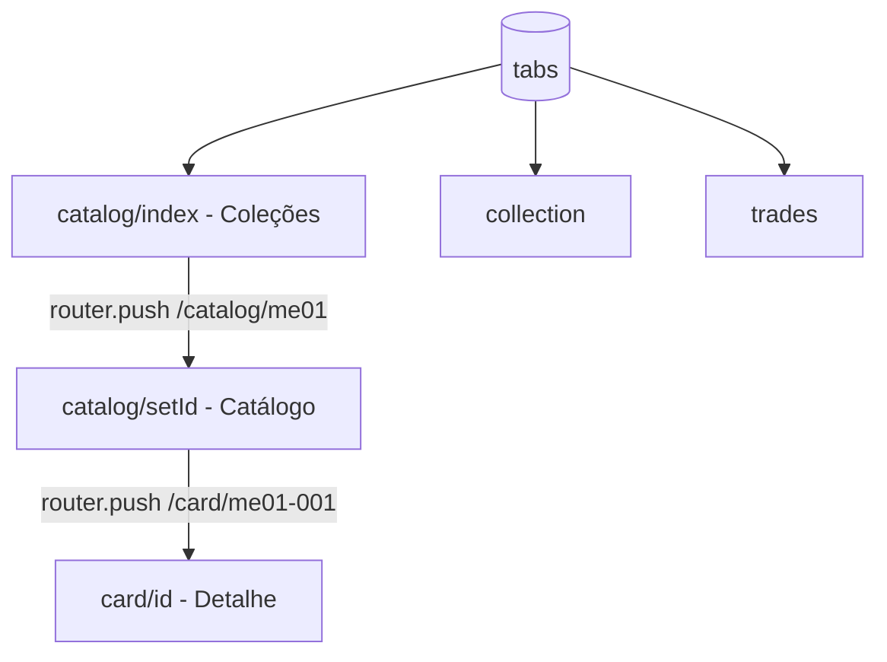

# AGENTS.md — Contexto para agentes de IA

Leia este arquivo **antes** de implementar mudanças neste repositório. Ele descreve o propósito do projeto, arquitetura, convenções e armadilhas conhecidas.

Documentação para humanos: [README.md](./README.md)  
Troubleshooting só de boot Expo: [.agent.md](./.agent.md)

---

## 1. Visão geral

| Campo | Valor |
|-------|--------|
| **Nome** | Pokemon Trade Center |
| **Tipo** | App mobile MVP (Expo / React Native) |
| **Domínio** | Pokémon TCG — catálogo de cartas, coleção pessoal, trocas (futuro) |
| **Idioma da UI** | Português (Brasil) |
| **Idioma dos dados** | Português via TCGdex (`pt`) |
| **Estágio** | Trabalho em andamento; várias telas são placeholder |
| **Repositório** | `https://github.com/thiagonunes11/pokemon-trade-center.git` |

### Objetivo do produto

Permitir que o usuário:

1. Escolha uma **expansão** (set) da série Megaevolução  
2. Navegue o **catálogo** de cartas com imagens e metadados da API  
3. Veja **detalhe** da carta e **adicione/remova** da coleção local  
4. (Futuro) Gerencie coleção completa e **trocas** com outros jogadores  

Não é escopo atual: backend próprio, autenticação, chat, pagamentos, scanner de cartas.

---

## 2. Stack técnica

| Camada | Tecnologia | Versão relevante |
|--------|------------|------------------|
| Runtime | Expo SDK | ~56 |
| Framework UI | React Native | 0.85 |
| UI library | React | 19 |
| Rotas | Expo Router (file-based) | ~56 |
| Estilo / tema | Tamagui + `src/theme` | tema `dark_phantom` |
| API cartas | `@tcgdex/sdk` | TCGdex REST, locale `pt` |
| Cache remoto | TanStack React Query | query keys por set/card |
| Estado local | Zustand | coleção em memória (sem persistência) |
| Imagens | `expo-image` | URLs `{base}/high.png` ou `.webp` |
| Animações | `react-native-reanimated` | telas de detalhe / grid |
| TypeScript | strict | paths `@/*` → `./src/*` |
| Nativo | pasta `android/` | development build (`expo run:android`) |

**Experiments ativos** (`app.json`): `typedRoutes`, `reactCompiler`.

---

## 3. Estrutura de diretórios (crítico)

```
src/app/                    ← Rotas Expo Router (NÃO usar /app na raiz)
  _layout.tsx               ← Root: QueryClient, Tamagui, Stack global
  (tabs)/
    _layout.tsx             ← Tab bar: Catálogo, Coleção, Trocas
    catalog/
      _layout.tsx           ← Stack interno (necessário para botão voltar)
      index.tsx             ← Lista de expansões (picker)
      [setId].tsx           ← Grid de cartas do set
    collection.tsx          ← Placeholder: só contador
    trades.tsx              ← Placeholder: texto estático
  card/[id].tsx             ← Detalhe da carta (Stack global, header nativo)

src/features/
  cards/                    ← CardGrid, CardItem, useSetCards, useCard
  sets/                     ← CollectionPickerCard, useCollections

src/lib/
  tcgdex.ts                 ← Cliente SDK + SUPPORTED_SETS
  collections.ts            ← COLLECTIONS[], disponibilidade, helpers
  formatCollectionProgress.ts  ← "005/188 cartas"
  queryClient.ts
  storagePolyfill.ts        ← Importar antes do SDK (side effect)

src/store/
  useCollectionStore.ts     ← Zustand: cards[], add/remove/has/getSetCardCount

src/theme/                  ← colors, typography
tamagui.config.ts           ← tema Tamagui na raiz do projeto
```

**Regra:** telas e rotas vivem em `src/app/`. O Expo detecta `src/app` como router root automaticamente.

---

## 4. Navegação e fluxos



| Rota | Arquivo | Header |
|------|---------|--------|
| `/(tabs)/catalog` | `catalog/index.tsx` | Stack: "Coleções" |
| `/(tabs)/catalog/[setId]` | `catalog/[setId].tsx` | Stack: título + badge `000/188 cartas` (custom `headerTitle`) |
| `/card/[id]` | `card/[id].tsx` | Stack global, opaco, botão voltar |

**Importante:** o fluxo Catálogo usa **Stack dentro da tab** (`catalog/_layout.tsx`). Tabs sozinhas **não** exibem botão voltar entre `index` e `[setId]`.

Navegação típica:

```ts
router.push(`/catalog/${setId}`);      // da lista de coleções
router.push(`/card/${cardId}`);       // do grid (cardId = ex. me02-001)
```

---

## 5. Dados — TCGdex API

### Cliente

```ts
// src/lib/tcgdex.ts
const tcgdex = new TCGdex("pt");
```

Sempre importar `@/lib/storagePolyfill` antes do SDK (já feito em `_layout.tsx` e `tcgdex.ts`).

### Expansões configuradas no app

Definidas em `SUPPORTED_SETS` + `COLLECTIONS` (`src/lib/collections.ts`):

| Constante | ID API | Nome exibido | Catálogo no app |
|-----------|--------|--------------|-----------------|
| `MEGAEVOLUCAO` | `me01` | Megaevolução | Sim |
| `FOGO_FANTASMAGORICO` | `me02` | Fogo Fantasmagórico | Sim |
| `HEROIS_EXCELSOS` | `me02.5` | Heróis Excelsos | Sim |
| `EQUILIBRIO_PERFEITO` | `me03` | Equilíbrio Perfeito | Sim |
| `CAOS_ASCENDENTE` | `me04` | Caos Ascendente | **Não** (0 cartas na API) |

### Disponibilidade de coleção

Lógica em `getCollectionAvailability()`:

- `loading` → query em andamento  
- `available` → `set.cards.length > 0`  
- `unavailable` → sem cartas na resposta (ex.: `me04` hoje)

UI: card desabilitado, `unavailableMessage` (ex.: "Catálogo em breve" para Caos Ascendente). **Não** depender de flag manual — habilita automaticamente quando a API passar a retornar cartas.

### URLs de imagem

- Logo do set: `https://assets.tcgdex.net/pt/me/{id}/logo.webp`  
- Carta alta resolução: `${card.image}/high.png` (detalhe) ou `/high.webp` (coleção)  
- IDs de carta: `{setId}-{localId}` (ex. `me02.5-042` — setId pode conter ponto)

### React Query keys

| Hook | queryKey |
|------|----------|
| `useSetCards(setId)` | `['set-cards', setId]` |
| `useCard(cardId)` | `['card', cardId]` |
| `useSet(setId)` | `['set', setId]` |
| `useCollections()` | um `['set', id]` por entrada em `COLLECTIONS` |

### Adicionar nova expansão

1. Confirmar ID em `https://api.tcgdex.net/v2/pt/sets/{id}` (verificar `cards.length > 0`)  
2. Adicionar em `SUPPORTED_SETS` (`tcgdex.ts`)  
3. Adicionar objeto em `COLLECTIONS` (`collections.ts`) com `logoUrl`  
4. Opcional: `unavailableMessage` se quiser texto customizado antes das cartas existirem  

**Não** instalar `@react-navigation/elements` — não está no projeto; usar `useLayoutEffect` + `navigation.setOptions` para header customizado.

---

## 6. Estado local — coleção do usuário

`src/store/useCollectionStore.ts`:

```ts
interface CollectionCard {
  id: string;           // ex. me02-001
  name: string;
  imageUrl: string | null;
  setId: string;        // ex. me02 — usar card.set?.id ao adicionar
  addedAt: Date;
}
```

- **Persistência:** nenhuma (reinicia ao fechar app)  
- **Duplicatas:** `addCard` não verifica duplicata; `hasCard` usado na UI  
- **Progresso no header:** `getSetCardCount(setId)` vs `setData.cardCount.total`

---

## 7. UI e tema

- **Tema escuro fixo** (`userInterfaceStyle: "dark"`)  
- Cores: `src/theme/colors.ts` — roxo fantasma + laranja fogo  
- Tamagui: `defaultTheme="dark_phantom"` em `tamagui.config.ts`  
- Muitas telas do catálogo usam **StyleSheet + theme colors**, não componentes Tamagui  
- Header do catálogo: componente `CatalogHeaderTitle` em `[setId].tsx` (título + badge contador)  
- Android: `includeFontPadding: false` no header customizado para alinhamento  

---

## 8. O que está pronto vs. planejado

### Implementado

- [x] Lista de expansões com logo e contagem via API  
- [x] Catálogo por set com grid, pull-to-refresh  
- [x] Detalhe da carta (imagem, stats, ataques)  
- [x] Adicionar/remover da coleção (Zustand)  
- [x] Contador `owned/total` no header do catálogo  
- [x] Desabilitar sets sem cartas na API  
- [x] Stack com voltar na navegação do catálogo  

### Placeholder / incompleto

- [ ] Aba **Coleção**: só exibe quantidade, sem lista de cartas  
- [ ] Aba **Trocas**: copy estático, sem lógica  
- [ ] Persistência AsyncStorage / SQLite  
- [ ] Sets `mep` (promos), `mee` (energias)  
- [ ] Busca, filtros, ordenação no grid  
- [ ] Testes automatizados  

---

## 9. Comandos úteis

```bash
npm install
npm start                    # Metro + menu Expo
npx expo start --android     # Abre no emulador
npm run android              # Build nativo + run (pasta android/)
npx expo start --clear       # Limpar cache Metro
npm run lint
```

Verificar cartas de um set (Node):

```bash
node -e "const T=require('@tcgdex/sdk').default; new T('pt').set.get('me04').then(s=>console.log(s?.cards?.length,s?.cardCount))"
```

---

## 10. Armadilhas e erros já vistos

| Problema | Causa | Solução |
|----------|--------|---------|
| Sem botão voltar no catálogo | Rota `[setId]` direto nas Tabs | Manter `catalog/_layout.tsx` como Stack |
| Topo da imagem coberto no detalhe | `headerTransparent` + padding só `insets.top` | Header opaco; conteúdo abaixo do header nativo |
| `Unable to resolve @react-navigation/elements` | Pacote não instalado | Não usar `useHeaderHeight`; padding manual ou header opaco |
| `useSafeAreaInsets` ReferenceError | Import removido com hot reload | Garantir imports corretos; reload completo |
| Set `me04` clicável sem cartas | API retorna `cards: []` | Usar `getCollectionAvailability` |
| ID `me02.5` no split | `id.split('-')[0]` funciona | Preferir `card.set?.id` ao salvar na coleção |
| Grep/Glob em paths `d:\...` | Ferramenta às vezes falha no Windows | Usar Shell `Get-ChildItem` ou paths relativos |

---

## 11. Diretrizes para contribuir (agentes)

1. **Escopo mínimo** — altere só o necessário para a tarefa; evite refatorações amplas.  
2. **Convenções existentes** — StyleSheet + `colors`, hooks em `features/`, config em `lib/`.  
3. **Sem novas deps** sem necessidade clara (projeto enxuto).  
4. **Textos de UI** em português brasileiro, tom claro (evitar "API" na interface do usuário).  
5. **Commits** — só quando o usuário pedir explicitamente.  
6. **README** — atualizar se mudar fluxo, sets ou comandos de setup.  
7. **Novos sets** — validar dados na TCGdex antes de habilitar na UI.  
8. **Não** mover rotas para `/app` na raiz; manter `src/app`.  

---

## 12. Arquivos-chave por tarefa

| Tarefa | Arquivos |
|--------|----------|
| Nova expansão na lista | `src/lib/tcgdex.ts`, `src/lib/collections.ts` |
| Texto / disabled no picker | `CollectionPickerCard.tsx`, `collections.ts` |
| Grid / item de carta | `src/features/cards/components/*` |
| Detalhe da carta | `src/app/card/[id].tsx` |
| Header catálogo | `src/app/(tabs)/catalog/[setId].tsx` |
| Navegação tabs/stack | `src/app/(tabs)/_layout.tsx`, `catalog/_layout.tsx` |
| Coleção do usuário | `src/store/useCollectionStore.ts` |
| Cores / tema | `src/theme/colors.ts`, `tamagui.config.ts` |
| Boot / Expo | `package.json`, `app.json`, `babel.config.js`, `.agent.md` |

---

## 13. Contato com o ecossistema

- [TCGdex API PT](https://api.tcgdex.net/v2/pt/series/me) — série Megaevolução  
- [TCGdex SDK docs](https://tcgdex.dev/)  
- [Expo Router](https://docs.expo.dev/router/introduction/)  

---

*Última revisão alinhada ao estado do repo: expansões me01–me04, stack de catálogo, contador de coleção, Caos Ascendente desabilitado por ausência de cartas na API.*
