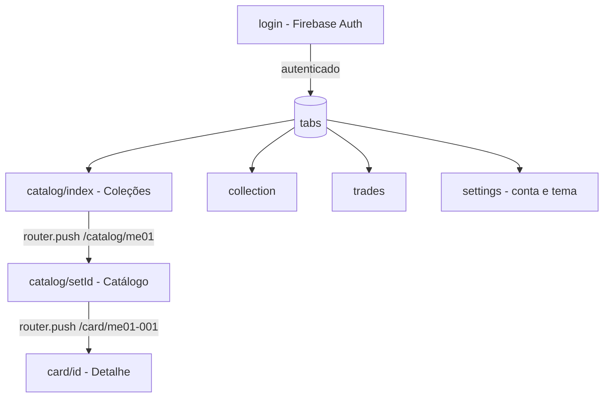
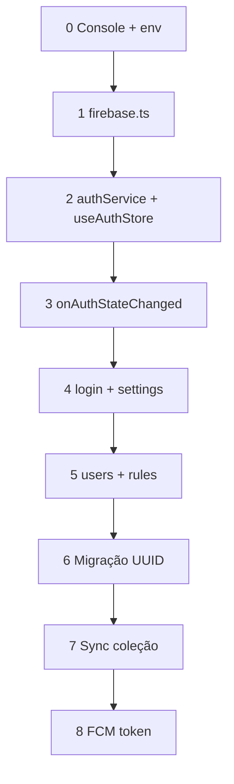

# AGENTS.md — Contexto para agentes de IA

Leia este arquivo **antes** de implementar mudanças neste repositório. Ele descreve o propósito do projeto, arquitetura, convenções e armadilhas conhecidas.

Documentação para humanos: [README.md](./README.md)  
Troubleshooting só de boot Expo: [.agent.md](./.agent.md)

---

## 1. Visão geral

| Campo                | Valor                                                              |
| -------------------- | ------------------------------------------------------------------ |
| **Nome**             | Pokemon Trade Center                                               |
| **Tipo**             | App mobile MVP (Expo / React Native)                               |
| **Domínio**          | Pokémon TCG — catálogo de cartas, coleção pessoal, trocas (futuro) |
| **Idioma da UI**     | Português (Brasil)                                                 |
| **Idioma dos dados** | Português via TCGdex (`pt`)                                        |
| **Estágio**          | MVP catálogo + coleção local; Firebase Auth + perfil Firestore ativos |
| **Repositório**      | `https://github.com/thiagonunes11/pokemon-trade-center.git`        |

### Objetivo do produto

Permitir que o usuário:

1. Escolha uma **expansão** (set) da série Megaevolução
2. Navegue o **catálogo** de cartas com imagens e metadados da API
3. Veja **detalhe** da carta e **adicione/remova** da coleção local
4. (Futuro) Gerencie coleção completa e **trocas** com outros jogadores

Escopo atual: catálogo TCGdex, coleção local (Zustand + `ownerId` = Firebase UID), tema e aba Ajustes.
**Auth & DB:** Firebase Auth + Firestore perfil e regras — `src/features/auth/*`, `useAuthStore`, `initAuthListener()` no `_layout.tsx`, `firestore.rules` (**Etapas 0–5** concluídas; ver **§8.3**).
**Próximo no Firebase:** Migração coleção UUID legado (Etapa 6), sync nuvem (Etapa 7), FCM (Etapa 8).

---

## 2. Stack técnica

| Camada        | Tecnologia                | Versão relevante                                                           |
| ------------- | ------------------------- | -------------------------------------------------------------------------- |
| Runtime       | Expo SDK                  | ~56                                                                        |
| Framework UI  | React Native              | 0.85                                                                       |
| UI library    | React                     | 19                                                                         |
| Rotas         | Expo Router (file-based)  | ~56                                                                        |
| Estilo / tema | Tamagui + `src/theme`     | Temas `dark_phantom` e `light_phantom` reativos                            |
| API cartas    | `@tcgdex/sdk`             | TCGdex REST, locale `pt`                                                   |
| Cache remoto  | TanStack React Query      | query keys por set/card + Persistência (safeStorage + getCircularReplacer) |
| Estado local  | Zustand                   | Coleção persistida (safeStorage + AsyncStorage)                            |
| Backend       | Firebase (Spark — free)   | Auth + Firestore perfil/regras ativos; sync coleção e FCM pendentes — §8.3   |
| Auth          | Firebase Auth (SDK JS)    | `firebase` ^12 · `src/lib/firebase.ts` · sessão AsyncStorage (RN) · §8.3    |
| Config local  | `.env` (gitignored)       | `EXPO_PUBLIC_FIREBASE_*` — template `.env.example`; ver README § Firebase   |
| Imagens       | `expo-image`              | URLs `{base}/high.png` ou `.webp`                                          |
| Animações     | `react-native-reanimated` | telas de detalhe / grid                                                    |
| TypeScript    | strict                    | paths `@/*` → `./src/*`                                                    |
| Nativo        | pasta `android/`          | development build (`expo run:android`)                                     |

**Experiments ativos** (`app.json`): `typedRoutes`, `reactCompiler`.

---

## 3. Estrutura de diretórios (crítico)

```
src/app/                    ← Rotas Expo Router (NÃO usar /app na raiz)
  _layout.tsx               ← Root: QueryClient, Tamagui, initAuthListener, guard isAuthReady
  login.tsx                 ← Firebase: Entrar / Criar conta / Esqueci senha
  (tabs)/
    _layout.tsx             ← Tab bar: Catálogo, Coleção, Trocas, Ajustes
    catalog/
      _layout.tsx           ← Stack interno (necessário para botão voltar)
      index.tsx             ← Lista de expansões (picker) — sem ThemeToggle no header
      [setId].tsx           ← Grid de cartas do set
    collection.tsx          ← Minha coleção: grid 4 colunas, Todas / Por coleção
    trades.tsx              ← Placeholder: texto estático
    settings.tsx            ← Tema, conta (avatar, nome, e-mail, logout), sobre
  card/[id].tsx             ← Detalhe da carta (Stack global, header nativo)
  index.tsx                 ← Redireciona `/` para `/catalog`

src/features/
  auth/                     ← authService, mapFirebaseUser, authErrors, userProfileService, index.ts
  cards/                    ← CardGrid, CardItem (prop `compact`), useSetCards, useCard
  sets/                     ← CollectionPickerCard, useCollections

src/hooks/
  useOwnedSetCount.ts       ← useOwnedSetCount, useOwnedCountsBySet (progresso local)

src/lib/
  firebase.ts               ← initializeApp + getAuth + persistência RN (AsyncStorage)
  firestore.ts              ← getFirestoreDb() singleton (Cloud Firestore)
  tcgdex.ts                 ← Cliente SDK + SUPPORTED_SETS
  collections.ts            ← COLLECTIONS[], disponibilidade, helpers
  formatCollectionProgress.ts  ← "005/188 cartas"
  energyIcons.ts            ← Nome TCGdex (pt/en) → require PNG em assets/images/energy/
  queryClient.ts
  queryPersister.ts         ← Cache offline-first do React Query (debounced)
  safeStorage.ts            ← Invólucro resiliente com fallback (Web/Expo Go)
  storagePolyfill.ts        ← Importar antes do SDK (side effect)

src/components/             ← Componentes globais e reutilizáveis
  ThemeToggle.tsx           ← Componente legado (não usado na UI; mantido para referência)
  EnergyIcon.tsx            ← Ícone / linha de tipos (assets/images/energy)
  UserAvatar.tsx            ← Avatar com inicial + cor por UID (Ajustes)

assets/images/energy/       ← PNGs locais (Fogo, Água, Planta, …) — ver energyIcons.ts

src/store/
  useAuthStore.ts           ← UID, email, username; login/register/logout/resetPassword/updateDisplayName; initAuthListener()
  useCollectionStore.ts     ← cards[] com ownerId (getSetCardCount só na store)

src/theme/                  ← colors, typography, ThemeContext (ThemeProvider, useAppTheme, useStyles)
tamagui.config.ts           ← temas Tamagui (dark_phantom e light_phantom) na raiz do projeto

# Raiz (config Firebase / secrets)
firebase.json               ← CLI: deploy de firestore.rules + indexes
firestore.rules             ← users/{uid}, collections/{uid}/cards/{cardId}
firestore.indexes.json
.env.example                ← placeholders (commitar)
google-services.json.example / GoogleService-Info.plist.example
# Locais gitignored: .env, google-services.json, GoogleService-Info.plist
```

**Regra:** telas e rotas vivem em `src/app/`. O Expo detecta `src/app` como router root automaticamente.

---

## 4. Navegação e fluxos



| Rota                      | Arquivo               | Header                                                 |
| ------------------------- | --------------------- | ------------------------------------------------------ |
| `/(tabs)/catalog`         | `catalog/index.tsx`   | Stack: "Coleções"; cada card mostra `000/188 cartas`   |
| `/(tabs)/catalog/[setId]` | `catalog/[setId].tsx` | Stack: título + badge `000/188` (`CatalogHeaderTitle`) |
| `/(tabs)/collection`      | `collection.tsx`      | Tab: grid 4 colunas; FAB contador abre filtro Todas / Por coleção |
| `/card/[id]`              | `card/[id].tsx`       | Stack global, opaco, botão voltar                      |
| `/login`                  | `login.tsx`           | Entrar / Criar conta / Esqueci senha; redireciona se autenticado |
| `/(tabs)/settings`        | `settings.tsx`        | Tab: avatar, editar nome, e-mail, logout, tema, sobre |

**Importante:** o fluxo Catálogo usa **Stack dentro da tab** (`catalog/_layout.tsx`). Tabs sozinhas **não** exibem botão voltar entre `index` e `[setId]`.

Navegação típica:

```ts
router.push({ pathname: "/catalog/[setId]", params: { setId } });
router.push({ pathname: "/card/[id]", params: { id: cardId } });
```

---

## 5. Dados — TCGdex API

### Cliente

```ts
// src/lib/tcgdex.ts
const tcgdex = new TCGdex("pt");
```

Sempre importar `@/lib/storagePolyfill` antes do SDK (já feito em `_layout.tsx` e `tcgdex.ts`).

### Expansões configuradas no app

Definidas em `SUPPORTED_SETS` + `COLLECTIONS` (`src/lib/collections.ts`):

| Constante             | ID API   | Nome exibido        | Catálogo no app           |
| --------------------- | -------- | ------------------- | ------------------------- |
| `MEGAEVOLUCAO`        | `me01`   | Megaevolução        | Sim                       |
| `FOGO_FANTASMAGORICO` | `me02`   | Fogo Fantasmagórico | Sim                       |
| `HEROIS_EXCELSOS`     | `me02.5` | Heróis Excelsos     | Sim                       |
| `EQUILIBRIO_PERFEITO` | `me03`   | Equilíbrio Perfeito | Sim                       |
| `CAOS_ASCENDENTE`     | `me04`   | Caos Ascendente     | Sim |

### Disponibilidade de coleção

Lógica em `getCollectionAvailability()`:

- `loading` → query em andamento
- `available` → `set.cards.length > 0`
- `unavailable` → sem cartas na resposta

UI: card desabilitado, `unavailableMessage` (ex.: "Catálogo em breve" para Caos Ascendente). **Não** depender de flag manual — habilita automaticamente quando a API passar a retornar cartas.

### Contador de progresso (`owned/total`)

Função: `formatCollectionProgress(owned, total)` em `src/lib/formatCollectionProgress.ts` → string `"005/188 cartas"` (padding mínimo 3 dígitos no owned).

| Onde                  | Como obter owned               | Como obter total                                 |
| --------------------- | ------------------------------ | ------------------------------------------------ |
| `catalog/index.tsx`   | `useOwnedCountsBySet()`        | `set.cardCount.total` ou `cards.length` da query |
| `catalog/[setId].tsx` | `useOwnedSetCount(validSetId)` | `setData.cardCount.total` ou `cards.length`      |

**Não** usar `useCollectionStore((s) => s.getSetCardCount)` em componentes — o selector de função não re-renderiza bem e já causou `Property 'getSetCardCount' doesn't exist` com hot reload. Preferir sempre os hooks em `src/hooks/useOwnedSetCount.ts`.

### URLs de imagem

- Logo do set: `https://assets.tcgdex.net/pt/me/{id}/logo.webp`
- Carta alta resolução: `${card.image}/high.png` (detalhe) ou `/high.webp` (coleção)
- IDs de carta: `{setId}-{localId}` (ex. `me02.5-042` — setId pode conter ponto)

### Ícones de tipo/energia (locais)

A API devolve **nomes** (`Fogo`, `Incolor`, etc.), não URLs de ícones pequenos. O app usa PNGs em `assets/images/energy/`:

| Arquivo | Tipos TCGdex (pt) |
|---------|-------------------|
| `fire.png` | Fogo |
| `water.png` | Água |
| `grass.png` | Planta |
| `electric.png` | Elétrico |
| `psychic.png` | Psíquico |
| `fighting.png` | Lutador |
| `dark.png` | Sombrio |
| `steel.png` | Metal |
| `fairy.png` | Fada |
| `dragon.png` | Dragão |
| `normal.png` | Incolor |

Mapeamento: `src/lib/energyIcons.ts` · UI: `src/components/EnergyIcon.tsx` (detalhe da carta). Tipos desconhecidos usam fallback com abreviação.

### Variantes (holo / reverse / normal)

A TCGdex expõe `variants` (booleanos) e `variants_detailed` (preços por acabamento). **Não há URL de imagem separada** por variante na maioria dos casos — o app usa um único `image` por carta. Útil para badges ou preços futuros; a coleção local ainda não grava qual variante o usuário possui.

### React Query keys

| Hook                 | queryKey                                      |
| -------------------- | --------------------------------------------- |
| `useSetCards(setId)` | `['set-cards', setId]`                        |
| `useCard(cardId)`    | `['card', cardId]`                            |
| `useSet(setId)`      | `['set', setId]`                              |
| `useCollections()`   | um `['set', id]` por entrada em `COLLECTIONS` |

### Adicionar nova expansão

1. Confirmar ID em `https://api.tcgdex.net/v2/pt/sets/{id}` (verificar `cards.length > 0`)
2. Adicionar em `SUPPORTED_SETS` (`tcgdex.ts`)
3. Adicionar objeto em `COLLECTIONS` (`collections.ts`) com `logoUrl`
4. Opcional: `unavailableMessage` se quiser texto customizado antes das cartas existirem

**Não** instalar `@react-navigation/elements` — não está no projeto; usar `useLayoutEffect` + `navigation.setOptions` para header customizado.

---

## 6. Estado local — coleção do usuário

`src/store/useCollectionStore.ts`:

```ts
interface CollectionCard {
  id: string; // ex. me02-001
  name: string;
  imageUrl: string | null; // URL completa ou base (verificar CardItem)
  setId: string; // ex. me02 — usar card.set?.id ao adicionar
  ownerId?: string | null; // novo: suporta coleções por usuário
  addedAt: Date;
}
```

- **Persistência:** Sim, via Zustand `persist` com `createJSONStorage(() => safeStorage)`. `safeStorage` faz fallback para `localStorage`/memória quando o módulo nativo (`AsyncStorage`) não está disponível (Expo Go).
- **Multi-usuário:** `useAuthStore.userId` = Firebase UID. `useCollectionStore` grava `ownerId` ao adicionar; selectores (`hasCard`, `getCardCount`, `getSetCardCount`) filtram por `ownerId`.
- **Chaves de storage:** coleção → `pokemon-collection-storage`. Auth **não** persiste em Zustand (sessão via Firebase + AsyncStorage no RN). Dados antigos em `ptc-auth-storage` (UUID legado) serão tratados na **Etapa 6** (migração).
- **Duplicatas:** `addCard` ainda não bloqueia duplicatas por design; `hasCard` é usado pela UI para evitar adicionar duas vezes.
- **Formato da imagem:** Ao adicionar em `card/[id].tsx`, `imageUrl` = `` `${card.image}/high.webp` `` ou `null`. O `CardItem` detecta URL já com `/high.webp` ou `/high.png` e não duplica o sufixo.
- **Prop `compact` em `CardItem`:** usar na aba Coleção; catálogo (`CardGrid`) mantém layout completo com nome e metadados.
- **Aba Coleção (`collection.tsx`):**
  - Modos: **`all` (Todas)** e **`bySet` (Por coleção)** — sem modo “Recentes”.
  - **Grid fixo de 4 colunas** (`GRID_COLUMNS = 4`), células dimensionadas com `useWindowDimensions` e proporção `CARD_ASPECT = 0.715`.
  - Constantes de layout: `GRID_GAP = 4`, `H_PADDING = 6`.
  - **Todas:** `FlatList` com `numColumns={4}`; **Por coleção:** `ScrollView` com seções e `flexWrap` no mesmo tamanho de célula.
  - `CardItem` com **`compact`** — só imagem (`contentFit="cover"`), sem nome/número; preenche a célula.
  - **FAB filtro (canto inferior direito):**
    - Botão circular (`FAB_SIZE = 52`) exibe **apenas o número** de cartas.
    - Toque alterna menu com opções **Todas** / **Por coleção** (substitui filtros no topo da tela).
    - Menu posicionado com `position: 'absolute'`, `bottom: FAB_SIZE + FAB_MENU_GAP`, `zIndex` menor que o FAB (surge “de trás” do contador).
    - Animação: `filterMenuEntering` / `filterMenuExiting` em `collection.tsx` — fade + `translateY` 8px (`withTiming` ~150ms). **Não** usar `SlideInUp` (parece vir do topo da tela).
  - Filtra cartas: `ownerId ?? null === authUserId ?? null`.
- **Como obter `setId` e `ownerId`:** `setId: card.set?.id ?? id.split('-')[0]`; `ownerId` é obtido de `useAuthStore.getState().userId` ao adicionar.
- **Progresso:** `useOwnedSetCount` / `useOwnedCountsBySet` continuam disponíveis e agora contam apenas cartas do `ownerId` atual.

---

## 7. UI e tema

- **Tema reativo — 3 modos** (`userInterfaceStyle: "automatic"` no `app.json`) com preferência persistida no `safeStorage` via `ThemeProvider`.
  - `ThemeMode = 'light' | 'dark' | 'system'` — exportado de `src/theme`
  - `setThemeMode(mode: ThemeMode)` — método principal para mudar o tema
  - `toggleTheme()` — mantido por compatibilidade mas marcado como `@deprecated`
  - Modo `system` resolve automaticamente pela preferência do SO (`useColorScheme`)
- **Paleta neutra e profissional** (desde 2026-05-27):
  - Primária: escala **slate** (`#020617` escuro → `#F8FAFC` claro) — azul-acinzentado neutro
  - Accent: **azul-cobalto** (`#2563EB` como 500) — saturação controlada, sem identidade de set
  - Background dark: quase preto neutro (`#09090F`) · Background light: branco puro (`#FFFFFF`)
  - A paleta anterior (roxo fantasma + laranja fogo) foi completamente substituída
- Cores: `src/theme/colors.ts` — paletas `darkColors` e `lightColors` sob a interface rigorosa `ColorPalette`. O export default aponta para `darkColors` para compatibilidade retroativa.
- Tamagui: Temas `dark_phantom` e `light_phantom` em `tamagui.config.ts`; `_layout.tsx` usa `defaultTheme`. **Os nomes foram mantidos** para evitar breaking change — mas os valores internos são agora slate/blue.
- **Estilos Dinâmicos (`useStyles`)**: Componentes que usam `StyleSheet` tradicional **não** re-renderizam automaticamente com mudanças de tema se usarem cores estáticas. Use obrigatoriamente o hook customizado `useStyles(stylesFactory)` do `ThemeContext.tsx` para definir folhas de estilo reativas dependentes de tema.
- **Tela de Configurações (`settings.tsx`)**, tab ⚙️ **Ajustes**:
  - **Conta:** `UserAvatar`, nome editável (`updateDisplayName`), e-mail de login (somente aqui), **Sair da conta** (`Alert` + `logout`).
  - **Aparência:** tema Claro / Escuro / Sistema (`setThemeMode`).
  - **Sobre:** versão, TCGdex, sets disponíveis.
- **Login (`login.tsx`)**: modos Entrar, Criar conta, Esqueci senha; erros via `authErrors.ts`; mensagem de sucesso no reset de senha.
- `ThemeToggle.tsx` está **inativo** na UI — foi removido do header do catálogo. Mantido no código sem uso.
- Android: `includeFontPadding: false` no header customizado para alinhamento.

---

## 8. O que está pronto vs. planejado

### Implementado

- [x] Lista de expansões com logo (me01–me04)
- [x] Catálogo por set com grid, pull-to-refresh
- [x] Detalhe da carta (imagem, stats, ataques)
- [x] Adicionar/remover da coleção (Zustand) com persistência offline robusta (`safeStorage`)
- [x] Cache persistido de dados das cartas da API com debouncing e suporte offline-first
- [x] Contador `owned/total` na tela Coleções e no header do catálogo
- [x] Desabilitar sets sem cartas na API (Caos Ascendente / `me04`)
- [x] Stack com voltar na navegação do catálogo
- [x] Firebase Auth: `src/features/auth/*`, `useAuthStore`, `firebase.ts`, guard `isAuthReady` (`_layout.tsx`)
- [x] Login e-mail + senha (`login.tsx`: Entrar / Criar conta / Esqueci senha)
- [x] Ajustes: `UserAvatar`, editar nome, e-mail, logout com confirmação (`settings.tsx`)
- [x] Tema **3 modos** (Claro / Escuro / Sistema) + paleta neutra (slate + cobalt-blue)
- [x] Aba Coleção: grid **4 colunas**, `CardItem` compact, FAB contador + menu filtro
- [x] Ícones de energia no detalhe (`EnergyIcon`, `assets/images/energy/`)
- [x] Firestore perfil `users/{uid}` (`userProfileService`, `firestore.ts`, `firestore.rules`)

### Placeholder / incompleto

- [ ] Aba **Trocas**: copy estático, sem lógica
- [/] **Auth Firebase (Spark)**: Etapas 0–5 feitas; Etapas 6–8 (migração, sync, push) — **§8.3**
- [ ] Sets `mep` (promos), `mee` (energias)
- [ ] Busca, filtros, ordenação no grid do catálogo
- [ ] Testes automatizados
- [ ] Preços, links externos (Liga / Limitless / MYP) — ver **§8.2 Fase 1**

---

## 8.1 Reaproveitamento — Deckmanager (PTCG Collector)

Projeto de referência no workspace: `Deckmanager/` (app offline do Rafael: decks, coleção, pool Liga, Pokédex). **Lista detalhada:** [docs/reaproveitamento-deckmanager.md](./docs/reaproveitamento-deckmanager.md).

### O que vale a pena (resumo)

| Prioridade | Itens |
|------------|--------|
| **Alta** | Mapa `me01`↔`MEG`, `me02`↔`PFL`, … · URL LigaPokemon · URL Limitless PT · parser `4 Carta SIGLA 040` · reprints na coleção (qty por nome) |
| **Média** | Metas básico/completo por set · progresso “faltam X” · import/export CSV com conversão de ID |
| **Baixa** | Pool Tools · decks preset Liga · Pokédex |
| **Preços (não está no Deckmanager)** | TCGdex `pricing` · estimativa R$ · mapa MYP · abrir Liga para lojas BR |

---

## 8.2 Roadmap de produto

Ordem sugerida para agentes e contribuidores. Marcar itens em **Implementado** (§8) quando concluídos.

### Fase 1 — Links e referência de mercado (MVP+)

- [ ] `ligaSetCodes.ts` + `buildLigaPokemonUrl(card)` — `ed`, `num`, label `Nome (localId/official)`
- [ ] `buildLimitlessUrl(ligaSet, localId)` — `https://limitlesstcg.com/cards/pt/{set}/{num}`
- [ ] Botões no detalhe `card/[id].tsx`: **Ver na Liga**, **Ver no Limitless** (`Linking.openURL`)
- [ ] Bloco **Preços (referência)** com `card.pricing` TCGdex + texto "valores internacionais; mercado BR pode diferir"
- [ ] (Opcional) Estimativa em R$ via câmbio do dia + aviso explícito de estimativa

### Fase 2 — Autenticação Firebase (Spark) — **Etapas 6–8 pendentes**

Implementação em etapas — detalhes, arquivos e checklist em **§8.3**. **Não** implementar `passwordHash` local nem `profiles[]` multi-conta: ir direto ao Firebase Auth.

**MVP utilizável (Etapas 0–5):** login real + perfil + regras Firestore — **concluído**.  
**MVP nuvem (Etapas 6–7):** migração UUID local + sync coleção — **prioridade atual**.  
**Push (Etapa 8):** quando houver trocas/notificações.

| Etapa | Entregável | Status |
|-------|------------|--------|
| 0 | Projeto Firebase Console, e-mail/senha, `google-services.json`, `.env` `EXPO_PUBLIC_FIREBASE_*` | Feito |
| 1 | `npx expo install firebase` · `src/lib/firebase.ts` | Feito |
| 2 | `src/features/auth/*` · refatorar `useAuthStore` (UID, `isAuthReady`, sem UUID local) | Feito |
| 3 | `onAuthStateChanged` em `_layout.tsx` · guard sem flash login/app | Feito |
| 4 | `login.tsx` (esqueci senha) · `settings.tsx` (logout, displayName) · `UserAvatar.tsx` | Feito |
| 5 | `users/{uid}` no Firestore · `firestore.rules` | Feito |
| 6 | Migração coleção local (`legacyLocalUserId` → UID) | Pendente |
| 7 | Sync `collections/{uid}/cards/{cardId}` · debounce writes (limites Spark) | Pendente |
| 8 | `expo-notifications` · `pushToken` em `users/{uid}` | Pendente |

### Fase 3 — Trocas e listas

- [ ] Parser de lista padrão (`parseDeckList`) — mesmo formato do Deckmanager
- [ ] `getOwnedQty` com reprints (match por `name` normalizado + ID/set)
- [ ] Aba **Trocas**: lista importada + "faltam X" / "tenho Y"

### Fase 4 — Coleção avançada e interoperabilidade

- [ ] Metas por set (`basic` / `complete`) inspiradas em `SET_THRESHOLDS`
- [ ] Import/export coleção: CSV Deckmanager + JSON backup; conversor `SIGLA_num` ↔ `me02-106`
- [ ] Variante na coleção (normal / holo / reverse) quando UX definida

### Fase 5 — Formato Liga e mercado BR

- [ ] Tabela `mypProductId` por `tcgdexId` (manual ou script; ex. `me02-106` → `300712`)
- [ ] Botão **Ver no MYP** quando ID mapeado
- [ ] Pool Tools / decks preset (dados do Deckmanager ou fonte própria) — escopo a definir

### Fase 6 — Catálogo e qualidade

- [ ] Busca, filtros, ordenação no grid do catálogo
- [ ] Sets `mep`, `mee` se fizer sentido na API
- [ ] Testes automatizados (parser, URLs, store)

**Fora do roadmap atual:** backend de trocas entre usuários, chat, pagamentos, scanner.

---

## 8.3 Firebase Auth + Firestore (Spark) — plano de implementação

### Estado atual do código

| Item | Situação |
|------|----------|
| `useAuthStore` | Firebase UID + `email` + `username` (displayName); `isAuthReady`, `isLoading`; sem persist UUID |
| `login.tsx` | E-mail + senha; Entrar / Criar conta / Esqueci senha |
| `settings.tsx` | Avatar, editar nome, e-mail, logout |
| `UserAvatar.tsx` | Inicial + cor por UID |
| `_layout.tsx` | `initAuthListener()` + overlay até `isAuthReady` + guard `/login` |
| `.env` | Local, gitignored; `cp .env.example .env` — valores de `google-services.json` / `.plist` ou Console |
| `useCollectionStore` | `ownerId` = Firebase UID nas cartas novas; coleção **só local** (Zustand) até Etapa 7 |
| `src/lib/firestore.ts` | `getFirestoreDb()` singleton |
| `userProfileService.ts` | `createUserProfile` / `updateUserProfile` em `users/{uid}` |
| `firestore.rules` + `firebase.json` | Regras deployáveis; DB em `southamerica-east1` |
| Pacote `firebase` | `^12`; `firebase.ts` com `initializeAuth` + `getReactNativePersistence(AsyncStorage)` no RN |

### Segredos e repositório público

| Arquivo | No Git? |
|---------|---------|
| `.env`, `google-services.json`, `GoogleService-Info.plist` | ❌ gitignored |
| `.env.example`, `*.example` | ✅ placeholders |
| `app.json` | ✅ aponta para paths locais dos arquivos nativos |

Após clone: README § Firebase. Se secrets vazaram: force-push + restringir API keys no Google Cloud. **Google Sign-In** no Console é opcional e **não** implementado no app.

### Por que Firebase Spark (gratuito)

| Serviço | Uso no app | Limite Spark (referência) |
|---------|------------|---------------------------|
| **Firebase Auth** | Cadastro / login e-mail + senha | Gratuito (uso típico ilimitado) |
| **Cloud Firestore** | Perfil `users/{uid}` + sync coleção | ~50k leituras/dia · ~20k escritas/dia · 1 GiB |
| **FCM via Expo** | Registrar `pushToken` (envio depois) | Gratuito |
| **Cloud Functions** | ❌ Não usar no Spark | Requer Blaze |

### Decisões de produto

- **E-mail** = identificador de login (Firebase Auth). **Username** = `displayName` (exibido em Ajustes). Não mostrar e-mail na UI principal se não for necessário.
- **Sem login só por username** no Spark (exigiria Cloud Function no Blaze).
- **Sem `passwordHash` no Zustand** — Firebase Auth gerencia credenciais.
- **Sem `profiles[]` multi-conta local** — trocar conta = logout + outro e-mail.
- **SDK:** `firebase` (modular JS) + `getReactNativePersistence(AsyncStorage)` — suficiente para Expo; `@react-native-firebase/*` só se surgir requisito nativo extra.

### Contrato `userId` (crítico)

```
Firebase Auth UID  →  useAuthStore.userId  →  CollectionCard.ownerId
```

- `useCollectionStore`, `useOwnedSetCount`, `card/[id].tsx` **não mudam** de shape — só o valor de `userId`/`ownerId` (UID em vez de UUID legado).
- Coleção gravada com UUID antigo permanece no dispositivo até a **Etapa 6** (migração).

### `useAuthStore` (implementado)

```ts
interface AuthState {
  userId: string | null;       // Firebase UID
  email: string | null;
  username: string | null;     // displayName
  isAuthReady: boolean;        // onAuthStateChanged concluído
  isLoading: boolean;
  register(email, password, displayName): Promise<void>;
  login(email, password): Promise<void>;
  logout(): Promise<void>;
  resetPassword(email): Promise<void>;
  updateDisplayName(name: string): Promise<void>;
}
```

Sessão real: Firebase Auth (`onAuthStateChanged` → `setSession`). Zustand espelha estado para a UI; **não** usa `persist`.

### Setup `.env` (obrigatório para auth)

1. `cp .env.example .env` na raiz do projeto.
2. Preencher `EXPO_PUBLIC_FIREBASE_*` a partir do [Firebase Console](https://console.firebase.google.com/) **ou** copiar de:
   - Android: `google-services.json` → `project_id`, `current_key`, `mobilesdk_app_id`
   - iOS: `GoogleService-Info.plist` → `PROJECT_ID`, `API_KEY`, `GOOGLE_APP_ID`, `GCM_SENDER_ID`
3. `authDomain` = `{project_id}.firebaseapp.com`
4. Arquivos nativos (`google-services.json`, `GoogleService-Info.plist`) também são **locais e gitignored** — ver `*.example` na raiz.
5. Após criar ou alterar `.env`: **`npx expo start --clear`** (Metro só lê env na subida).

Sem `.env` válido: `isFirebaseConfigured()` = false e a tela de login exibe aviso.

### Boot do app (ordem)

1. `ThemeProvider`
2. `onAuthStateChanged` → `isAuthReady` + usuário
3. `restoreQueryCache` (React Query, como hoje)
4. Remover overlay / aplicar guard (`!user && isAuthReady` → `/login`)

Evitar redirecionar antes de `isAuthReady` (flash login ↔ app).

### Etapas de implementação

#### Etapa 0 — Console Firebase (fora do repo)

- [x] Criar projeto; plano **Spark**
- [x] Authentication → **E-mail/senha** habilitado
- [x] App **Android** (`com.pokemontradecenter.app`) → `google-services.json` na raiz (local, **gitignored**) + `android.googleServicesFile` no `app.json`; template `google-services.json.example` no repo
- [x] App **iOS** (mesmo Bundle ID) → `GoogleService-Info.plist` na raiz (local, **gitignored**) + `ios.googleServicesFile` no `app.json`; template `GoogleService-Info.plist.example` no repo
- [ ] App **Web** (opcional) → `firebaseConfig` no `.env` para Expo Web
- [x] Variáveis `EXPO_PUBLIC_FIREBASE_*` em `.env` local (`.env.example` com placeholders no repo; `.env` + arquivos nativos no `.gitignore`)

**iOS + Android:** arquivos nativos são **por plataforma** (Expo copia no prebuild); Auth/Firestore via SDK JS usam o **mesmo** `project_id` e usuários compartilhados no Firebase. Ver README § Firebase.

#### Etapa 1 — SDK

- [x] `npx expo install firebase` (`firebase` ^12 no `package.json`)
- [x] `src/lib/firebase.ts` — `initializeApp`, `initializeAuth` + `getReactNativePersistence(AsyncStorage)` no RN; `getAuth` na web; `isFirebaseConfigured`

#### Etapa 2 — Serviço de auth

- [x] `src/features/auth/authService.ts` — `createUserWithEmailAndPassword`, `signInWithEmailAndPassword`, `signOut`, `sendPasswordResetEmail`
- [x] `src/features/auth/mapFirebaseUser.ts` — `User` → `{ userId, email, username }`
- [x] `src/features/auth/authErrors.ts` — códigos `auth/*` → mensagens PT-BR
- [x] Refatorar `src/store/useAuthStore.ts` — remover `uuidv4()` como login

#### Etapa 3 — Guard global

- [x] Hook ou listener em `src/app/_layout.tsx` (`initAuthListener`)
- [x] Overlay “Carregando…” até `isAuthReady` + cache local
- [x] Autenticado em `/login` → `replace('/')` (redireciona para catálogo)

#### Etapa 4 — UI

- [x] `login.tsx` — modos **Entrar** / **Criar conta** / **Esqueci senha**; e-mail, senha; nome no cadastro; loading, erros e sucesso inline
- [x] `settings.tsx` — `UserAvatar`, alterar nome (`updateDisplayName`), e-mail de login, logout com confirmação (`Alert`)
- [x] `src/components/UserAvatar.tsx` — inicial + cor determinística por `userId` (UID)
- [x] (Etapa 5) Renomear também espelha em Firestore `users/{uid}`

#### Etapa 5 — Firestore perfil + regras

Schema:

```
users/{userId}
  displayName: string
  email: string
  pushToken?: string
  createdAt: Timestamp
  migrationCompleted?: boolean

collections/{userId}/cards/{cardId}
  id: string
  name: string
  imageUrl: string | null
  setId: string
  addedAt: Timestamp
```

- [x] Após registro: `setDoc(users/{uid}, …)` merge
- [x] `firestore.rules` — usuário só lê/escreve próprio `users/{uid}` e `collections/{uid}/**`
- [x] Correção de resiliência: fallback de `updateUserProfile` para `createUserProfile` quando a atualização falhar (ex.: usuários legados sem documento no Firestore, evitando erros de permissão ou inexistência).

Esboço de regras:

```javascript
match /users/{userId} {
  allow read, write: if request.auth != null && request.auth.uid == userId;
}
match /collections/{userId}/cards/{cardId} {
  allow read, write: if request.auth != null && request.auth.uid == userId;
}
```

#### Etapa 6 — Migração local → nuvem

- [ ] Persistir `legacyLocalUserId` ao detectar sessão antiga em `ptc-auth-storage`
- [ ] Primeiro login Firebase: se coleção Zustand tem `ownerId === legacyLocalUserId` → modal “Importar N cartas?”
- [ ] Reescrever `ownerId` para UID + upload Firestore (Etapa 7) · marcar `migrationCompleted`

#### Etapa 7 — Sync coleção (economizar Spark)

- [ ] `src/features/collection/firestoreSync.ts` (ou `src/lib/`) — write on `addCard`/`removeCard` com debounce
- [ ] Leitura: `getDocs` no login ou listener só na aba Coleção (evitar listener global permanente)
- [ ] Campos alinhados ao Zustand; `ownerId` implícito no path `collections/{uid}/`

#### Etapa 8 — Push (opcional, pós-trocas)

- [ ] `expo-notifications` + permissões
- [ ] `updateDoc(users/{uid}, { pushToken })`
- [ ] Sem Cloud Functions no MVP para enviar push

### O que não fazer no Spark

| Evitar | Motivo |
|--------|--------|
| Login apenas com username | Precisa Blaze + Functions |
| Senha/hash no Zustand | Duplica Firebase Auth |
| Cloud Functions | Não incluso no Spark |
| Sync com listener 24/7 em toda coleção | Estoura leituras gratuitas |
| Múltiplos perfis locais `profiles[]` | Modelo Firebase = 1 conta por e-mail |

### Mapa de arquivos

| Prioridade | Arquivo |
|------------|---------|
| — | `src/lib/firebase.ts`, `src/lib/firestore.ts`, `src/features/auth/*`, `useAuthStore.ts`, `_layout.tsx`, `login.tsx`, `settings.tsx`, `UserAvatar.tsx` — **Etapas 0–5** |
| Alta | `src/features/collection/firestoreSync.ts` (Etapa 7) + migração UUID (Etapa 6) |
| Alta | `.env` (local) + `.env.example` + `*.example` nativos |
| Média | `firestore.rules` deploy: `firebase deploy --only firestore:rules` (requer Firebase CLI + login) |
| Baixa | EAS secrets para `google-services.json` / `.plist` em CI |

**Sem alteração de contrato na Fase 2:** `useCollectionStore.ts`, `useOwnedSetCount.ts`, `card/[id].tsx` (só consomem `userId`).

### Checklist de validação manual

1. [x] Cadastro e-mail/senha + nome → catálogo; `ownerId` das novas cartas = UID.
2. [x] Fechar e reabrir app → sessão persiste (AsyncStorage via Firebase Auth RN).
3. [x] Logout → `/login`; outro login não vê cartas do `ownerId` anterior (filtro local).
4. [ ] Regras Firestore em produção: deploy `firestore.rules`; usuário A não lê `collections/{uidB}/...`.
5. [ ] Migração (Etapa 6): UUID em `ptc-auth-storage` → importar coleção no primeiro login Firebase.
6. [ ] Sync (Etapa 7): carta adicionada aparece em `collections/{uid}/cards/{cardId}` após debounce/rede.

### Diagrama de dependências



---

## 9. Comandos úteis


```bash
npm install
cp .env.example .env         # Preencher EXPO_PUBLIC_FIREBASE_* (ver §8.3)
npm start                    # Metro + menu Expo
npx expo start --android     # Abre no emulador
npm run android              # Build nativo + run (pasta android/)
npx expo start --clear       # Limpar cache Metro (obrigatório após mudar .env)
npm run lint

# Firestore (após firebase login + projeto selecionado)
firebase deploy --only firestore:rules
```

Verificar cartas de um set (Node):

```bash
node -e "const T=require('@tcgdex/sdk').default; new T('pt').set.get('me04').then(s=>console.log(s?.cards?.length,s?.cardCount))"
```

---

## 10. Armadilhas e erros já vistos

| Problema                                          | Causa                                                                    | Solução                                                                                                                                      |
| ------------------------------------------------- | ------------------------------------------------------------------------ | -------------------------------------------------------------------------------------------------------------------------------------------- |
| Sem botão voltar no catálogo                      | Rota `[setId]` direto nas Tabs                                           | Manter `catalog/_layout.tsx` como Stack                                                                                                      |
| Topo da imagem coberto no detalhe                 | `headerTransparent` + padding só `insets.top`                            | Header opaco; conteúdo abaixo do header nativo                                                                                               |
| `Unable to resolve @react-navigation/elements`    | Pacote não instalado                                                     | Não usar `useHeaderHeight`; padding manual ou header opaco                                                                                   |
| `useSafeAreaInsets` ReferenceError                | Import removido com hot reload                                           | Garantir imports corretos; reload completo                                                                                                   |
| `getSetCardCount doesn't exist`                   | Hot reload / selector de função no Zustand                               | `useOwnedSetCount`; `expo start --clear`                                                                                                     |
| Set `me04` clicável sem cartas                    | API retorna `cards: []`                                                  | Usar `getCollectionAvailability`                                                                                                             |
| ID `me02.5` no split                              | `id.split('-')[0]` funciona                                              | Preferir `card.set?.id` ao salvar na coleção                                                                                                 |
| Grep/Glob em paths `d:\...`                       | Ferramenta às vezes falha no Windows                                     | Usar Shell `Get-ChildItem` ou paths relativos                                                                                                |
| `TypeError: cyclical structure`                   | SDK retorna objetos com referências circulares                           | Usar `getCircularReplacer` debounced em `JSON.stringify`                                                                                     |
| `AsyncStorage native module null`                 | Rodando em Web sandbox ou Expo Go sem compilar nativo                    | Usar `safeStorage` (inicia no modo fallback localStorage/memória)                                                                            |
| Grid da coleção com colunas erradas               | Largura fixa sem `useWindowDimensions`                                   | Recalcular `cellWidth` / `cellHeight` ao rotacionar ou redimensionar                                                                           |
| Menu de filtro “vem do topo”                      | `SlideInUp` do Reanimated anima da base da tela                          | Fade + `translateY` curto ancorado no FAB (`filterMenuEntering` em `collection.tsx`)                                                           |
| Raiz `/` sem `src/app/index.tsx`                  | Expo Router mostra `Unmatched Route` ao abrir o app                      | Criar `src/app/index.tsx` com `Redirect href="/catalog"`                                                                                     |
| `INSTALL_FAILED_INSUFFICIENT_STORAGE` no emulador | APK antigo ou espaço cheio no dispositivo virtual                        | Desinstalar pacote com `adb uninstall com.pokemontradecenter.app` ou limpar dados do emulador                                                |
| VirtualizedList lento ao rolar                    | `FlatList` com renderItem pesado / animações em cada item                | Memoizar `CardItem`, usar `FlatList` com `initialNumToRender`, `windowSize`, `removeClippedSubviews`                                         |
| Estilos estáticos não reagem a mudança de tema    | `StyleSheet.create` é avaliado uma vez na inicialização                  | Usar o hook `useStyles(theme => StyleSheet.create(...))` em vez de `StyleSheet.create` estático                                              |
| Erro `unmatched route` ao iniciar o app           | Retornar tela de carregamento condicional no root layout                 | Sempre renderizar a `<Stack>` global e cobrir com overlay absoluto (`StyleSheet.absoluteFill`)                                               |
| Incompatibilidade de cores literais TypeScript    | Cores hexadecimais inferidas como literais estritos                      | Tipar os objetos de cor explicitamente com a interface comum `ColorPalette`                                                                  |
| “Firebase não configurado” no login               | Ausência de `.env` ou variáveis `EXPO_PUBLIC_FIREBASE_*` vazias          | `cp .env.example .env`, preencher chaves; `npx expo start --clear`                                                                           |
| Auth não persiste entre sessões (RN)              | `getAuth` sem `initializeAuth` + AsyncStorage                            | Usar `getFirebaseAuth()` em `firebase.ts` (já com `getReactNativePersistence`)                                                               |
| Flash login ↔ app ao abrir                        | Guard antes de `onAuthStateChanged`                                      | Aguardar `isAuthReady` no `_layout.tsx` antes de `router.replace('/login')`                                                                  |
| Coleção “sumiu” após login Firebase              | Cartas com `ownerId` = UUID legado (`ptc-auth-storage` antigo)           | Etapa 6: migração `legacyLocalUserId` → UID                                                                                                  |

---

## 11. Diretrizes para contribuir (agentes)

1. **Escopo mínimo** — altere só o necessário para a tarefa; evite refatorações amplas.
2. **Convenções existentes** — StyleSheet + `colors`, hooks em `features/`, config em `lib/`.
3. **Sem novas deps** sem necessidade clara (projeto enxuto).
4. **Textos de UI** em português brasileiro, tom claro (evitar "API" na interface do usuário).
5. **Commits** — só quando o usuário pedir explicitamente.
6. **README** e **AGENTS.md** — atualizar se mudar fluxo, sets, layout de telas ou comandos de setup.
7. **Novos sets** — validar dados na TCGdex antes de habilitar na UI.
8. **Não** mover rotas para `/app` na raiz; manter `src/app`.
9. **Secrets** — nunca commitar `.env` nem `google-services.json` / `.plist` reais; só `*.example` com placeholders.

---

## 12. Arquivos-chave por tarefa

| Tarefa                     | Arquivos                                                                     |
| -------------------------- | ---------------------------------------------------------------------------- |
| Nova expansão na lista     | `src/lib/tcgdex.ts`, `src/lib/collections.ts`                                |
| Texto / disabled no picker | `CollectionPickerCard.tsx`, `collections.ts`                                 |
| Contador owned/total       | `formatCollectionProgress.ts`, `useOwnedSetCount.ts`, picker + `[setId].tsx` |
| Grid / item de carta       | `src/features/cards/components/*`                                            |
| Detalhe da carta           | `src/app/card/[id].tsx`                                                      |
| Header catálogo            | `src/app/(tabs)/catalog/[setId].tsx` (`CatalogHeaderTitle`)                  |
| Navegação tabs/stack       | `src/app/(tabs)/_layout.tsx`, `catalog/_layout.tsx`                          |
| Login / guard              | `useAuthStore.ts`, `initAuthListener`, `login.tsx`, `_layout.tsx`              |
| Esqueci senha              | `login.tsx`, `useAuthStore.resetPassword`, `authService.sendPasswordReset`     |
| Conta / logout / avatar    | `settings.tsx`, `UserAvatar.tsx`, `useAuthStore.updateDisplayName` / `logout`  |
| Firebase Auth + perfil     | `firebase.ts`, `firestore.ts`, `src/features/auth/*`, `firestore.rules`, §8.3 |
| Deploy regras Firestore    | `firebase.json`, `firestore.rules` — `firebase deploy --only firestore:rules`   |
| Setup env Firebase         | `.env.example`, `.env` (local), `google-services.json`, `GoogleService-Info.plist` |
| Sync coleção Firestore     | `src/features/collection/firestoreSync.ts` (planejado), §8.3 Etapa 7           |
| Aba Minha Coleção (grid 4 + FAB) | `src/app/(tabs)/collection.tsx`, `CardItem.tsx` (`compact`)              |
| Coleção do usuário (store) | `src/store/useCollectionStore.ts`, `src/hooks/useOwnedSetCount.ts`           |
| Cores / tema / provider    | `src/theme/colors.ts`, `src/theme/ThemeContext.tsx`, `tamagui.config.ts`     |
| Seletor de tema (3 modos)  | `src/app/(tabs)/settings.tsx`, `src/theme/ThemeContext.tsx` (`setThemeMode`) |
| Tela de configurações      | `src/app/(tabs)/settings.tsx`                                                |
| Ícones de energia/tipo     | `assets/images/energy/`, `src/lib/energyIcons.ts`, `EnergyIcon.tsx`          |
| Links Liga / Limitless     | (planejado) `src/lib/ligaSetCodes.ts`, `src/lib/externalCardLinks.ts`        |
| Parser de lista / trocas   | (planejado) `src/lib/parseDeckList.ts` — ver roadmap §8.2                      |
| Roadmap / Deckmanager      | `docs/reaproveitamento-deckmanager.md`, §8.1–8.2 deste arquivo                 |
| Boot / Expo                | `package.json`, `app.json`, `babel.config.js`, `.agent.md`                   |

---

## 13. Contato com o ecossistema

- [TCGdex API PT](https://api.tcgdex.net/v2/pt/series/me) — série Megaevolução
- [TCGdex SDK docs](https://tcgdex.dev/)
- [Expo Router](https://docs.expo.dev/router/introduction/)

---

## 14. Atualizações recentes

### 2026-05-28 — Sincronização AGENTS.md com o código

- Estado real: **Etapas 0–5 concluídas**; coleção ainda **local** (Etapa 7); migração UUID pendente (Etapa 6).
- Documentados `firestore.ts`, `firebase.json`, política de secrets, comando `firebase deploy --only firestore:rules`.
- Fase 2 roadmap: prioridade = Etapas 6–7.

### 2026-05-27 — Firebase Auth (Etapas 0–4)

| Etapa | Entregue |
|-------|----------|
| 0–1 | Console Spark, `firebase` ^12, `firebase.ts`, `.env` + arquivos nativos gitignored |
| 2 | `src/features/auth/*`, `useAuthStore` (sem UUID local / sem `persist`) |
| 3 | `initAuthListener`, guard `isAuthReady`, overlay de boot |
| 4 | Login (Entrar / Criar conta / Esqueci senha), Ajustes (avatar, nome, logout), `UserAvatar.tsx` |

**Próximo:** Etapa 6 — migração coleção local (`legacyLocalUserId` → UID).

### 2026-05-27 — Etapa 5: Firestore perfil + regras

| Item | Entregue |
|------|----------|
| Firestore DB | Criado em `southamerica-east1` (São Paulo), plano Spark |
| `firebase.json` | Config CLI para rules + indexes |
| `firestore.rules` | Regras com validação rigorosa: `users/{uid}` e `collections/{uid}/cards/{cardId}` |
| `src/lib/firestore.ts` | Singleton `getFirestoreDb()` |
| `userProfileService.ts` | `createUserProfile` (registro) + `updateUserProfile` (renomear) |
| `authService.ts` | Integração: cria perfil no Firestore após registro; espelha nome no Firestore |
| Resiliência | Fallback para `createUserProfile` em `updateUserDisplayName` se a atualização falhar, garantindo criação retroativa de perfis de usuários legados (evitando erros de permissão) |

### 2026-05-28 — Plano Firebase Auth (Spark)

- **§8.3** reescrito: estado atual do código, etapas 0–8, contrato `userId`, alvo `useAuthStore`, regras Firestore, migração UUID → UID, sync com limites Spark, mapa de arquivos e checklist de QA.
- **§8.2 Fase 2** unificada com Firebase (sem auth local com `passwordHash` / `profiles[]`).
- Antiga “Fase 5 Firebase” absorvida na Fase 2; fases 5–7 renumeradas (Liga → 5, Catálogo → 6).
- Plano inicial Firebase Auth (etapas 0–8) documentado em §8.3.

### 2026-05-25 — Roadmap e Deckmanager

- Análise do projeto **Deckmanager** (PTCG Collector) no workspace.
- Lista de reaproveitamento: [docs/reaproveitamento-deckmanager.md](./docs/reaproveitamento-deckmanager.md).
- **§8.1** (resumo) e **§8.2** (roadmap em fases) adicionados neste arquivo.

### 2026-05-26 — Coleção, energia e detalhe

**Aba Coleção (`collection.tsx`):**

- Grade **4 colunas**; `CardItem` **`compact`** (só imagem).
- Modos **Todas** / **Por coleção** (sem “Recentes”).
- **FAB** circular: só o número; toque abre menu de filtro acima do botão.
- Animação do menu: fade + 8px a partir do FAB (não `SlideInUp`).

**Detalhe / assets:**

- `assets/images/energy/` — 11 PNGs (todos os tipos PT da TCGdex).
- `energyIcons.ts` + `EnergyIcon.tsx` — tipos, custos de ataque, fraqueza/resistência no detalhe.

**Variantes holo (API):** `variants` / `variants_detailed` existem na TCGdex; o app ainda não deixa escolher normal/holo/reverse na coleção — uma imagem por `id`.

### Histórico

- Auth local (nome → UUID) substituído por Firebase Auth (Etapas 0–4).
- Coleção com `ownerId`, cache React Query, tema 3 modos, contador owned/total no catálogo.

### 2026-05-27 — Tema neutro e tela de Configurações

**Paleta de cores (`colors.ts` + `tamagui.config.ts`):**

- Tema antigo (roxo fantasma + laranja fogo) **completamente substituído** por paleta neutra e profissional.
- `primary`: escala **slate** (azul-acinzentado, `#020617` → `#F8FAFC`).
- `accent`: **azul-cobalto** (`#2563EB` como 500).
- Background dark: `#09090F` (quase preto neutro) · Background light: `#FFFFFF` (branco puro).
- `shadowColor` dark: preto semitransparente · light: sombra neutra muito suave.
- Nomes dos temas Tamagui (`dark_phantom`, `light_phantom`) mantidos para não quebrar `_layout.tsx`.

**Sistema de tema (`ThemeContext.tsx`):**

- Novo tipo `ThemeMode = 'light' | 'dark' | 'system'` exportado de `src/theme`.
- Método `setThemeMode(mode)` substituiu `toggleTheme` como API principal.
- Modo `system` resolve via `useColorScheme` do SO em tempo real.
- `toggleTheme` mantido como `@deprecated` para compatibilidade.

**Tela de Configurações (`settings.tsx`):**

- Nova tab ⚙️ **Ajustes** na barra de navegação.
- Seções: **Conta** (nome do usuário), **Aparência** (seletor de tema com radio buttons), **Sobre** (versão, API, série).
- `ThemeToggle` removido do header de `catalog/index.tsx`.

**Teste rápido (auth):** criar conta → Catálogo → adicionar carta → Ajustes (avatar, renomear) → logout → login → Esqueci senha.

**Teste rápido (app):** login → Catálogo → Coleção (grid + FAB) → detalhe (tipos) → Ajustes (tema).

_Última revisão: 2026-05-28 (Etapas 0–5 Firebase; próximo: migração + sync coleção)._
